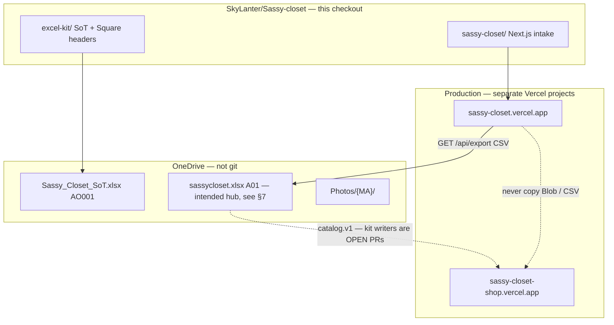

# Sassy Closet — website codebase map

Map of **our current websites** for Mini Boss / CloudAgents. Written from this checkout (`main` @ `ba33024`, 2026-09-15) plus a **read-only live probe** the same day. **Hunches are labeled.** Granola was not signed in on this run; Slack `#shop-decisions` still has the 2026-09-04 Square / draft-only standing rules.

**This job is docs only.** No UI redesign. No mã / stock / price invention. No Square Save. No Facebook Send/Post. No secrets.

---

## 0. How to read this

| Marker | Meaning |
| --- | --- |
| **In this checkout** | Code on `main` in `SkyLanter/Sassy-closet` |
| **Live probe 2026-09-15** | `curl` against Production. Fact for that hour, not a license to copy rows |
| **Open PR (not on `main`)** | Sibling work. Do not assume it is deployed |
| **Hunch** | Inferred from PRs / HTML, not proven in this tree |

Do **not** treat this file as inventory. Square Free remains on-hand truth. Website rows are staged / shop tiles, not stock.

---

## 1. Two websites, one kit repo, one missing shop repo

```text
https://sassy-closet.vercel.app          INTAKE  (this repo)
https://sassy-closet-shop.vercel.app     SELL-TEST (separate Origin repo — not in this checkout)
```

| Surface | URL | Source of truth for *code* | Vercel | Job |
| --- | --- | --- | --- | --- |
| **Intake** | https://sassy-closet.vercel.app | This repo · folder `sassy-closet/` · Root Directory **`sassy-closet`** | Project for the intake host | GF **Món mới / Sửa / Tìm mã / Ask**. Mint A01-style mãs into **intake Blob** |
| **Sell-test** | https://sassy-closet-shop.vercel.app | Origin repo (prompt: `tiensidequests/tmp-87ea3acf7683fefe`). **Not cloned here.** `gh` could not resolve that name from this token | Separate Vercel project | Customer tiles + `/m/{MA}` + `/admin`. Messenger CTA. `noindex` |
| **Official shop** | *not stood up from this checkout* | Same shop git as sell-test, **new** Vercel project + **new** Blob (hunch from open [PR #18](https://github.com/SkyLanter/Sassy-closet/pull/18) `CLONE_TO_OFFICIAL`) | Must never be the intake project | Future customer host |

**Hunch:** the Origin slug `tiensidequests/tmp-87ea3acf7683fefe` is a Cursor Origin / tmp workspace id, not a public GitHub repo this agent can fetch. Shop edits belong there, not in `sassy-closet/`.

They **share a brand and A01-style letter codes**. They do **not** share a git tree, a Vercel project, or a Blob store. Do not attach the shop domain to intake. Do not set intake webhook envs on sell-test. Do not import intake `store.json` / CSV onto shop tiles.



---

## 2. Intake app router / key routes

App: Next.js 15 + React 19 + Tailwind, `sassy-closet/`. CI: `.github/workflows/sassy-closet.yml` (`npm test`, `typecheck`, `build`) on `sassy-closet/**` only.

### 2.1 Pages

| Route | File | What it is |
| --- | --- | --- |
| `/` | `app/page.tsx` → `IntakeApp` | Four tabs only. `/?ma=A01` opens **Sửa** and `GET /api/submissions/{ma}` |
| `/admin` | `app/admin/page.tsx` | **Kit export CSV** + storage-mode line. Link to `/api/export`. No login. No import. No Square. |

`app/layout.tsx` — fonts Nunito + Allura, title “Sassy Closet”. Footer on `/` links to `/admin`.

**Tabs** (`TabId` in `lib/types.ts`): `create` · `edit` · `find` · `ask`. UI labels: **Món mới** · **Sửa theo mã** · **Tìm mã · Find** · **Hỏi Mini Boss · Ask**. No fifth tab. No Post / Send / Square Save button.

### 2.2 APIs

| Method | Path | Persist? | Notes |
| --- | --- | --- | --- |
| `GET` | `/api/submissions` | read | `{ submissions, storage }`. **Public.** Full staff rows (cost, source_link, photos). |
| `POST` | `/api/submissions` | **create** | `multipart/form-data` → `saveFromForm` → `saveSubmission`. Mints next mã for `kind` unless `new_ma` is set. |
| `GET` | `/api/submissions/[ma]` | read | `{ ma, caption_vi, submission }` or 404 Vietnamese miss |
| `PATCH` | `/api/submissions/[ma]` | **update** | Same form as create. Rename via `new_ma`. 404 if mã missing |
| `GET` | `/api/export` | read | CSV `filename=sassy-closet.csv`. Staff columns including `cost_*` + `source_link` |
| `GET` | `/api/photos/[...path]` | read | Bytes from Blob/disk. UI src is `/api/photos/{ma}/{file}` |
| `GET` | `/api/ma/[code]` | read | `{ code, staged, on_hand, staged_only }`. Empty on-hand → staged-only. **404 for `AO001`** (live probe). |
| `POST` | `/api/find-ma` | read | One `photo` file; SHA-256 match against stored `photo_hashes` |
| `GET`/`POST` | `/api/fx` | write on POST | Weekly USD→CNY. Default empty store `6.71` / `2026-09-07` |
| `POST` | `/api/ask` | in-memory | Creates ask; relays or local draft |
| `GET` | `/api/ask/[id]` | in-memory | Poll until `ready` (~45s then fallback) |
| `POST` | `/api/ask/reply` | in-memory | `{id, answer}` gated by `ASK_REPLY_SECRET` |
| `POST` | `/api/mini-boss` | none | Direct rules draft (no store). Legacy/helper |

**Not present on intake `main`:** `GET /api/catalog` (live 404). No catalog import route. No `INTAKE_DATASET_SYNC_*` helper file (that is [PR #42](https://github.com/SkyLanter/Sassy-closet/pull/42), still **OPEN** — §6).

### 2.3 Client save / find / ask (what GF actually clicks)

1. **Món mới → Lưu & lấy mã** — `POST /api/submissions` with kind, sizes, colors, optional cost/sell/link/photos. Opens `SavedCard` (copy mã / `/?ma=` / caption starter). Then resets the create form.
2. **Sửa → Mở → Lưu thay đổi** — `PATCH /api/submissions/{ma}`. Optional **Đổi mã** (`new_ma`: letter `P` = next P, or full `P10`). Changing kind on an open row pre-fills rename to `nextMa(newKind, knownMas)`.
3. **Tìm mã** — code box → `GET /api/ma/{code}` → `FindMaCard`. Photo drop → `POST /api/find-ma` (exact file hash only).
4. **Ask** — `POST /api/ask` then poll `GET /api/ask/{id}` for 45s (`AskPanel.tsx`).

`IntakeApp` always posts `pieces` as `[]` today. Older live rows may still have leftover `pieces` from an earlier UI (live A01 still has two piece objects). **Hunch:** the next Sửa-save on those rows will wipe `pieces` unless the form starts sending them again.

---

## 3. Data model (intake)

Canonical TypeScript: `sassy-closet/lib/types.ts`. On-disk / Blob JSON: `StoreFile` in `lib/store-backend.ts`.

### 3.1 Mã rules — **two dialects. Do not collapse them.**

**Intake + live hub letter codes** (`sassy-closet/lib/mint.ts` + `lib/kinds.ts`):

| Letter | Label (UI) | Example |
| --- | --- | --- |
| **A** | Áo | `A01` |
| **Q** | Quần | `Q01` |
| **V** | Váy | `V01` |
| **D** | Đầm / Dress | `D01` (added [PR #17](https://github.com/SkyLanter/Sassy-closet/pull/17)) |
| **K** | Áo khoác | `K01` |
| **G** | Giày | `G01` |
| **B** | Túi | `B01` |
| **P** | Phụ kiện | `P01` |
| **H** | Tóc | `H01` |
| **J** | Trang sức | `J01` |
| **S** | Set đồ | `S01` |
| **O** | Khác / Other | `O01` |

- Regex: one of those letters + **2+ digits**, `n` in `1…999`. `formatMa`: 2 digits under 100 (`A01`), 3 at 100+ (`A100`).
- `nextMa(kind, existing)` = max number **for that letter** + 1. Does **not** fill holes. `nextMa("P", ["P01","P02","P05"])` → **`P06`** (tested).
- `parseHubMa("AO001")` is **null** (two letters). `GET /api/ma/AO001` live 404.
- Create with empty `new_ma` → mint. Create/update with `new_ma` = letter only → mint that letter. Full code → use it if free (409 if taken). Invalid → 400 (“chữ P … hoặc đủ số kiểu P10”).
- **Hard stop in comments / tests:** never invent a mã that is not this sequential mint or an explicit rename. Excel-kit `parse_ma` must **not** be taught A01 in the same PR as a site mint change (`schema.py` lines 620–621, 874).

**Excel-kit / SoT / Square SKU** (`excel-kit/schema.py`):

`AO` `QU` `VA` `AK` `GI` `PK` `SET` + **exactly 3 digits** (`AO001`). Scripts **never mint**. Missing mã → `ASK_STOCK_MA` (Dashboard `B21:B27`). Square template: SKU = that mã.

Root `README.md` and `excel-kit/PROMPTS.md` still describe the **AO001** law for kit/Square. The **website** mints **A01**. Both are current. A01 ≠ AO001.

### 3.2 `Submission` (one staged row)

| Field | Role |
| --- | --- |
| `id` | Integer from `store.nextId` |
| `ma` | A01-style code |
| `kind` | `KindCode` |
| `size` | Space-joined chips (`"S M L"`). Optional |
| `color` | Comma-joined Vietnamese chip labels (`"Kem, Xanh"`). Optional |
| `color_note` | Free text |
| `pieces` | `Piece[]` (`id`, `photos[]`, `suggested[]`, `color`, `note`). **Schema exists; current UI sends `[]`** |
| `link` | Normalized source URL only (see §3.3) |
| `price` | Copy of `sell_usd` at save time |
| `cost_cny` / `cost_usd` / `cost_currency` | Optional staff cost. Currency `USD` or `CNY` from which field GF filled |
| `sell_cny` / `sell_usd` / `sell_currency` | Optional staff sell. **Not** Square price. **Not** automatically the shop tile |
| `blurb` / `blurb_suggested` / `caption_en` | Present; create path sets `blurb` to `""` |
| `caption_vi` | Built by `buildCaptionVi` on save (mã, cute line, size, color, sell, footer) |
| `photo_paths` | `["A01/001.jpg", …]` relative keys |
| `photo_hashes` | SHA-256 hex per uploaded file (find-by-photo) |
| `status` | Always `"staged"` on save |
| `square` | Always `"not_square"` on save |
| `photo_link` | Always `Documents/Sassy Closet/Photos/{ma}/` (folder path, **not** bytes) |
| `created_at` / `updated_at` | ISO strings |

**On-hand** (`store.on_hand[ma]`): optional bag. `saveSubmission` **never writes it**. `GET /api/ma` reads + `sanitizeOnHandRows`. Empty → UI **“Staged only — not on Square On_Hand yet”**. Never invent qty / storage. Allowed statuses: `on_hand` \| `reserved` \| `sold` \| `dead`.

**FX:** `{ usd_cny, updated }` on the store. UI converts CNY↔USD live; bad mid-typing returns `null` and leaves the other box alone.

### 3.3 `source_link` normalize

`lib/source-link.ts` `normalizeSourceLink`:

- Empty / no `http(s)` URL → `""` (never invent a link).
- Pulls URL(s) out of a full Taobao share paste (Chinese wrapper, 淘口令, trailing punctuation).
- Prefers host `e.tb.cn` / `tb.cn` / `taobao.com` / `tmall.com` if several URLs appear.
- Saved on `Submission.link`. CSV header is `source_link`. Find-card field is `source_link`.

### 3.4 Colors / pieces / sizes

- Color **chips** (`lib/kinds.ts` `COLORS`): Vietnamese labels stored on `color` (comma-separated). Chip `code` is internal (`kem`, `khac`, …).
- **Sizes:** `2XS XS S M L XL 2XL` only (Asian). Multi-select → space-joined.
- **Pieces:** designed as per-photo color groups. Export column `color_pieces` = `P1: … | P2: …`. Current form does not edit them.

### 3.5 Store file shape

```ts
{ nextId: number, submissions: Submission[], fx: { usd_cny, updated }, on_hand?: Record<string, unknown> }
```

- **Durable (Production):** Vercel Blob `sassy-closet/store.json` + `sassy-closet/photos/{rel}`.
- **Local:** `sassy-closet/data/submissions.json` + `data/photos/` (`SASSY_DATA_DIR` override).
- **Ephemeral:** `VERCEL` set and no Blob env → `/tmp/sassy-closet-data` (**redeploy wipes**).

`parseStore` refuses garbage / missing `submissions` array (“không ghi đè”) so a corrupt Blob cannot be overwritten with an empty closet.

---

## 4. How GF create / update persists

```text
UI Lưu
  → POST /api/submissions          (create)
  → PATCH /api/submissions/[ma]    (update / rename)
      → saveFromForm(form, existingMa?)     lib/form-save.ts
          → saveSubmission(input)           lib/store.ts
              → loadStore()  (Blob or disk; one-time local→Blob migrate if Blob empty)
              → resolveSaveMa()
              → writePhoto for each new file  ({ma}/{001}.jpg …)
              → build Submission  status=staged square=not_square
              → persistStore()
              → return row
      → SavedCard
```

**Create:** no `existingMa`. Mint or honor `new_ma`. `nextId++`.

**Update:** `existingMa` must exist (404). Same mã unless `new_ma`. Photos: `keep_photos` JSON list of relative paths; new files append `003…`. Clearing all keep + no new files clears hashes.

**What is not persisted here:** on-hand, Square, Facebook, shop catalog, Excel. Caption is regenerated from fields; `blurb` stays `""` on this path.

---

## 5. PR #42 webhook path — **not on `main`**

[PR #42](https://github.com/SkyLanter/Sassy-closet/pull/42) *Intake webhook → dataset sync* is **OPEN** (branch `cursor/intake-dataset-sync-webhook-7d57`). **This checkout does not contain** `lib/intakeDatasetSyncWebhook.ts` or any `INTAKE_DATASET_SYNC_*` read.

**If/when it merges**, the intended path (from the PR, not from `main`) is:

```text
saveSubmission → persistStore → notifyIntakeDatasetSyncWebhook("create"|"update", row)
```

| Env (names only) | Rule |
| --- | --- |
| `INTAKE_DATASET_SYNC_WEBHOOK_URL` | Grok Bot routine `intake-dataset-sync-webhook` POST URL |
| `INTAKE_DATASET_SYNC_WEBHOOK_KEY` | `Authorization: Bearer …` + `X-Automation-Key` |

Both required or **no-op** (save still succeeds). Fail / timeout (~8s, no retry) → log, **do not roll back**. Payload: `event`, `ma`, `timestamp`, `source: "intake"`, optional sizes/colors/cost/sell/`source_link`/kind/`photo_count`. Blanks omitted. No invented fields. **Intake Vercel only. Never sell-test.** Poll backup is described as already existing on Grok Bot.

Until merge + Boss paste + **Redeploy intake**, Production does not fire this webhook.

---

## 6. Photos

| Layer | Path |
| --- | --- |
| Intake Blob key | `sassy-closet/photos/{ma}/{nnn}.jpg\|jpeg\|png\|webp` |
| Public intake URL | `/api/photos/{ma}/{nnn}.jpg` |
| Stored on the row | `photo_paths: ["A01/001.jpg"]` |
| Excel / card folder | `Documents/Sassy Closet/Photos/{ma}/` |
| Find thumbs | Max **3** in one row (`FIND_CARD_THUMB_LIMIT`); `+N`; tap → `PhotoLightbox` (Esc / backdrop / ✕) |
| Find-by-photo | Exact SHA-256 of the uploaded bytes vs `photo_hashes` — not vision / color detect in current `main` (older “tighten color detect” PR #6 is still draft) |

`sanitizePhotoRel` strips `..`. Local backend rejects paths outside `photos/`. Missing Blob object → empty, not a crash (`isMissingBlobError`).

**Hunch:** [PR #41](https://github.com/SkyLanter/Sassy-closet/pull/41) (OPEN) wants photo GET `Cache-Control: private, no-store` and Blob `useCache: false` on overwriteable reads. Live intake photo GET on 2026-09-15 was still `public, max-age=0, must-revalidate` (function default).

---

## 7. Catalog export / import · Excel hub (`sassycloset.xlsx`)

### 7.1 What intake can export **today** (`main`)

- **Only** `GET /api/export` → CSV columns:

  `ma,kind,kind_vi,size,color,color_note,color_pieces,blurb,cost_cny,cost_usd,cost_currency,sell_cny,sell_usd,sell_currency,source_link,status,square,created_at,updated_at,photo_link`

- `/admin` is a download button for that file.
- **No import** of CSV / `catalog.v1` / xlsx on the intake app.
- This CSV is a **staff dump**. It is **illegal** as shop `catalog.v1` (cost + source_link + staff sell). Open-kit docs say P05-style staff cells must not become a customer `$`.

### 7.2 `sassycloset.xlsx` hub — intended, **not on `main`**

[PR #8](https://github.com/SkyLanter/Sassy-closet/pull/8) (OPEN) is the hub builder:

- Land path: `Documents/Sassy Closet/sassycloset.xlsx` (keep the existing OneDrive folder; **not** `Documents/sassycloset/`).
- `kit.sh save` would `GET https://sassy-closet.vercel.app/api/export`, rebuild `out/sassycloset.xlsx`, sync `out/Photos/{ma}/`.
- Sheet **All**: `ma` first, `source_link` col B, then kind/colors/sell/cost/status/`photo_folder`.
- Job: **offline backup if the website dies**. Always keep `ma` + `source_link`.

**On `main` today** the kit’s live workbook story is still **`Sassy_Closet_SoT.xlsx`** (AO001 Official / Wishlist / Orders / Dashboard). `build_sassycloset_hub.py` / `kit.sh` are **not** in this tree.

### 7.3 `catalog.v1` shop handoff — **not on `main`**

[PR #18](https://github.com/SkyLanter/Sassy-closet/pull/18) (OPEN) is the kit writer: `excel-kit/scripts/export_sell_catalog.py` + `SELL_CATALOG_CONTRACT.md`. Allowlist-only JSON, no cost / source / invented titles. Hold ⇔ `priceUsd: null`.

**Live probe 2026-09-15 (sell-test, not this repo):** `GET /api/admin/catalog` **200** JSON `{ schema: "catalog.v1", source: "blob", siteId: "sassy-closet-shop", products: […] }`. Public `GET /api/catalog` still **404**. Product objects on the shop now include keys the Sept 9 kit contract did not list (`sourceLink`, `fitCm`, `fulfillment`, `sizes`, …). **Hunch:** Origin shop schema has moved; do not “fix” it from this kit by inventing a second writer.

**Do not** import intake CSV or `store.json` onto sell-test.

### 7.4 Square “catalog import”

`excel-kit/square/` — **headers-only** Square item-library CSV. Not the website. SKU = **AO001-style** mã. Agents never Save.

---

## 8. Env vars that matter (names only — never paste values)

Documented in `sassy-closet/README.md` and `excel-kit/KIT.md`.

| Name | Where | Effect if missing |
| --- | --- | --- |
| `BLOB_READ_WRITE_TOKEN` | Intake Vercel / `vercel env pull` | No durable Blob token |
| `BLOB_STORE_ID` | Auto when Blob connected (OIDC on Vercel) | Together with token → `storageMode() === "durable"` |
| `BLOB_ACCESS` | Optional `private` (default) or `public` | Must match the store you created |
| `SASSY_DATA_DIR` | Local / restore | Default `sassy-closet/data/` or `/tmp/sassy-closet-data` on Vercel |
| `MINIBOSS_ASK_WEBHOOK_URL` | Ask relay | With key missing → **Mini Boss offline — local draft** |
| `MINIBOSS_ASK_WEBHOOK_KEY` | Bearer + `x-miniboss-ask-key` | Same |
| `ASK_REPLY_SECRET` | `POST /api/ask/reply` | Reply route 401 if unset / wrong |
| `GROK_API_KEY` | Documented | **Unused** unless someone wires an LLM; rules draft is default |
| `VERCEL` | Platform | Without Blob → ephemeral `/tmp` |
| `INTAKE_DATASET_SYNC_WEBHOOK_URL` | **PR #42 only** | No-op if unset |
| `INTAKE_DATASET_SYNC_WEBHOOK_KEY` | **PR #42 only** | Both required or no-op |

Ask records live in `globalThis.__sassyAsks` (**in-memory**). Redeploy / cold start drops waiting asks. That is separate from mã Blob durability.

---

## 9. Hard stops already in code / comments

Copied from the tree, not new policy:

- **Never invent mã / qty / $ / storage / photos / source links.** Tests assert empty inputs stay empty; on-hand sanitizer does not invent qty; `parseStore` will not treat `{}` as an empty closet.
- **Always `status: "staged"` + `square: "not_square"`** on Lưu. Site is not Square.
- **Missing on-hand → staged-only banner**, not a fake count (`lib/on-hand.ts`).
- **Ask / Saved / Find copy-only.** `lib/ask-fallback.ts`: “Copy thôi — Mini Boss không Post, không Send, không Square Save, không tự đặt mã.”
- **Bots draft only** in `excel-kit/` (append scripts, Square template, prompts).
- **Excel-kit never mints** (`MissingMaError` / `ASK_STOCK_MA`). Do not “fix” that by copying `nextMa` into `schema.py`.
- **No passwords / tokens** in git (`.gitignore` `.env*`; docs say names only).
- **Four intake tabs.** No Post / Send / Square Save control on the site.

Slack `#shop-decisions` (2026-09-04): Square Free is live; Track stock ON; **no item Save until Boss yes**; bots draft only.

---

## 10. Cookbook — how to change X

### Add a field (intake)

1. Add it to `Submission` in `lib/types.ts` (and `MaStaged` / find-card if GF must see it).
2. Thread it through `SaveInput` + `saveSubmission` + `saveFromForm` (form key).
3. Add the input in `IntakeApp` `ItemForm` (create + edit). Load it in `applySubmission`.
4. If Kit backup needs it: add a column in `exportCsv` (and remember open hub PR #8 if that merges).
5. Test: save → get → export; empty must stay empty (no invented default $ / link).
6. **Do not** add Square Save, FB Send, or a shop-tile publish button.

### Change a mã letter

1. `KIND_CODES` + `KINDS` in `lib/kinds.ts`.
2. Cute caption line in `lib/captions.ts` `BLURB_VI`.
3. Tests in `tests/fx.test.ts` / `ask-and-saved.test.ts` / store mint tests.
4. **Do not** add the letter to `excel-kit/schema.py` `MA_RE` as if it were `AO`. Different dialect.
5. **Do not** mint that letter on sell-test or Official Excel from this change.
6. Kind **D** is the template ([PR #17](https://github.com/SkyLanter/Sassy-closet/pull/17)).

### Deploy **intake only**

1. PR against `SkyLanter/Sassy-closet` `main`. Path filter CI covers `sassy-closet/**`.
2. Vercel project whose Production URL is **`sassy-closet.vercel.app`**. Root Directory **`sassy-closet`**.
3. Confirm Blob still connected (Production). After deploy: `/admin` should say durable; a known mã still in `/api/export`; `/api/photos/{ma}/001.jpg` still 200.
4. **Do not** redeploy or env-edit **`sassy-closet-shop`**.
5. **Do not** “clone official” by pointing a domain at intake.

Local:

```bash
cd sassy-closet
npm install
npm test
npm run typecheck
npm run dev
```

---

## 11. Sell-test handoff (source **not** in this checkout)

**Repo:** Origin / tmp workspace (prompt id `tiensidequests/tmp-87ea3acf7683fefe`). This Cloud Agent could not `gh repo view` it. **Do not try to “fix the shop” by editing `sassy-closet/`.**

**Live probe 2026-09-15** (HTML + headers; shop may have moved since the Sept 9–10 learn PRs):

| Route | Live |
| --- | --- |
| `/` | Home tiles. `robots: noindex, nofollow`. Messenger `m.me` + Page id in footer. Word **Inbox for price** on hold tiles. **No `$23` string** in home HTML |
| `/c/ao` `/c/ao-khoac` `/c/phu-kien` `/c/set` `/c/toc` | Category boards (also `/c/pk` 200) |
| `/m/{MA}` | PDP. **Unknown mã returns HTTP 200** titled `Item not found · Sassy Closet` (not a 404 status) — `/m/B01`, `/m/D01`, `/m/Q01`, `/m/A13`, `/m/AO001` all “not found” |
| `/admin` | Title **Sell ops · Sassy Closet**. “Test only · Sell-test · sassy-closet-shop · not …”. Storage: **Vercel Blob · shop and admin share this catalog** |
| `/admin/new` `/admin/edit/{MA}` `/admin/settings` | 200 |
| `/products/{MA}/cover.jpg` (+ `photo-N.jpg`, `?v=` cache buster on some covers) | 200 JPEG |
| `/editorial/*.jpg` | Home art |
| `/api/admin/catalog` | **200** `catalog.v1` (this was 404 in Sept 10 learn notes — Origin moved) |
| `/api/catalog` | Still 404 |
| `/robots.txt` | Disallow `/admin/` `/api/` |
| Home / admin cache | `private, no-store` on this probe (Sept 10 notes said ISR `stale-time: 300` on `/` — **stale**) |

**Tiles on home / admin / catalog `products[]` this hour:** `A01 S01 P01 P02 P03 P04 P05 K01 H01 A02` **plus `A03`**. That is **11** shop rows. Older kit allowlists stopped at ten and treated A03 as forbidden. **Do not invent a 12th.** Do not treat intake’s extra staged mãs (B/D/J/O/Q/S… — live intake listed **38** staged rows this hour) as shop tiles.

Admin HTML (this hour) says unused letter-codes are **not** shop tiles until **Boss Add → Save**. That is **Origin policy**, and it **conflicts** with kit law “never invent mã” if someone clicks Add without a Boss-assigned code. CloudAgents: **do not mint on the shop.**

**Look lock (from open learn PRs, not this tree):** paper / blush / gold, Be Vietnam + Cormorant — **not** intake Allura / `#D82B60`. Kelly Ying editorial. No cart. Message on Messenger. Zelle as a **word** only. No personal names.

**Apply lists that are docs-only in *this* repo’s open PRs (not merged):** #27 QA checklist, #28 F1–F16 Blob/Save, #32 admin matrix O0–O22, #41 catalog-arch note. Use them only after re-probing live — several Sept 10 facts are already wrong (A03 exists; `/api/admin/catalog` exists; home cache is no-store).

### Mini Boss: starting a shop-only Cloud Agent

1. Open the **Origin** shop repo, not `SkyLanter/Sassy-closet`, unless the task is kit/intake docs.
2. Re-probe `/`, `/admin`, `/api/admin/catalog`, `/m/A01`, one missing mã.
3. Keep intake Blob and shop Blob **apart**.
4. Hard stops unchanged: no invent mã/stock/prices, no Square Save, no FB Send, no secrets in PRs.

---

## 12. Related open PRs (kit / docs — not deployed from `main`)

| PR | Topic | On `main`? |
| --- | --- | --- |
| [#8](https://github.com/SkyLanter/Sassy-closet/pull/8) | `sassycloset.xlsx` hub + `kit.sh save` | No |
| [#18](https://github.com/SkyLanter/Sassy-closet/pull/18) | `catalog.v1` export + clone-official runbook | No |
| [#24](https://github.com/SkyLanter/Sassy-closet/pull/24) / [#41](https://github.com/SkyLanter/Sassy-closet/pull/41) | Next+Blob catalog architecture + intake cache APPLY | No |
| [#29](https://github.com/SkyLanter/Sassy-closet/pull/29) | AI clothing-shop playbook (docs) | No |
| [#42](https://github.com/SkyLanter/Sassy-closet/pull/42) | `INTAKE_DATASET_SYNC_*` after Lưu | No |

Learn-track drafts #19–#40 are mostly sell-test visual / admin notes. They are **not** intake source.

---

## 13. File index (intake — start here)

| Path | Job |
| --- | --- |
| `sassy-closet/lib/kinds.ts` | Letters, sizes, color chips |
| `sassy-closet/lib/mint.ts` | Parse / format / next / exists |
| `sassy-closet/lib/source-link.ts` | URL-only from share paste |
| `sassy-closet/lib/store.ts` | Save, list, export, find-hash |
| `sassy-closet/lib/store-backend.ts` | Disk vs Blob |
| `sassy-closet/lib/form-save.ts` | Multipart → `SaveInput` |
| `sassy-closet/lib/ma-card.ts` | Tìm mã payload |
| `sassy-closet/lib/on-hand.ts` | Staged-only, no fake qty |
| `sassy-closet/lib/ask-store.ts` | In-memory ask + Mini Boss webhook |
| `sassy-closet/lib/ask-fallback.ts` | Local draft copy |
| `sassy-closet/lib/captions.ts` | Caption + `/?ma=` link |
| `sassy-closet/lib/fx.ts` | CNY↔USD |
| `sassy-closet/lib/photos.ts` | Thumb cap + `/api/photos` src |
| `sassy-closet/components/IntakeApp.tsx` | All four tabs + save |
| `sassy-closet/BOSS.md` | One-pager |
| `excel-kit/schema.py` | AO001 + SoT headers (**not** A01) |
| `excel-kit/KIT.md` | Env names |

---

## 14. Top 5 gotchas for future CloudAgents

1. **Two mã languages.** Site = `A01`. Kit/SoT/Square = `AO001`. `parse_ma` must stay legacy. `AO001` is not a find-card hit. Do not “unify” them in a drive-by.

2. **Two Vercel apps / two Blobs.** Intake Lưu does not update shop tiles. Shop `/admin` Blob is not `sassy-closet/store.json`. Redeploying the wrong project, or copying intake CSV onto the shop, publishes staff sell/cost (the P05 `$23` lesson in open catalog docs).

3. **Intake mint ≠ Boss assignment.** `nextMa` is “next unused number **on this Blob** for that letter.” Shop admin copy about “Boss Add assigns the next unused letter-code” is Origin HTML, not permission for an agent to create A14 / B01 as a customer tile. Excel still **ASK STOCK**.

4. **`main` is behind the website conversation.** Dataset-sync webhook (#42), hub xlsx (#8), and `catalog.v1` writer (#18) are **open**. Learn-track facts from 2026-09-09/10 (A03 must 404; no `/api/admin/catalog`; ISR 300s) are **already stale** vs 2026-09-15 live shop. Re-probe before applying those checklists.

5. **Public staff APIs + fragile extras.** `GET /api/submissions` and `/api/export` are unauthenticated staff dumps. Ask is **RAM-only**. `pieces` will be wiped on the next Sửa-save. `on_hand` is never written by Lưu. Production without Blob still dies on redeploy. Photo find is **byte-hash**, not “looks like.”

---

## 15. Live intake snapshot (2026-09-15, not inventory)

Read-only `GET /api/submissions`: `storage.durable = true`, **38** rows, every row `staged` / `not_square`. Kinds present: A, B, D, H, J, K, O, P, Q, S (no live **V** or **G** this hour). `/api/fx` still `usd_cny: 6.71`. This list **will** grow when GF taps Lưu. Do not copy it into Official Excel or shop tiles. Do not treat it as Square on-hand.

---

## 16. Meetings / async

- Granola MCP: **unauthorized** this run (no account). Could not cite a 2026-09-15 Boss transcript.
- Slack `#shop-decisions`: Square Track ON + draft-only (2026-09-04). No `CODEBASE_MAP` / `INTAKE_DATASET_SYNC` hits in search.
- Linear: no useful Sassy Closet architecture issue (workspace sample was generic “Import your data”).

If someone said “what we discussed” about webhook vs poll, that lives in the PR #42 prompt pack / Grok Bot routine panel — not in this tree.
