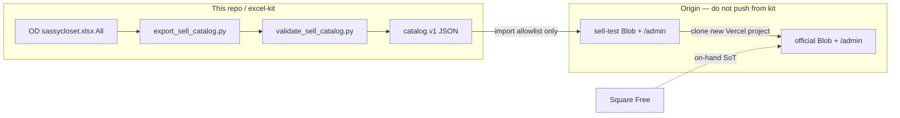

# 04 — Next.js + Vercel Blob headless clothing catalog architecture

LEARN TRACK (apply playbook). Written 2026-09-09 against `main` @ `ba33024` plus the open kit handoff on [PR #18](https://github.com/SkyLanter/Sassy-closet/pull/18).

This note is the architecture for a **headless clothing catalog**: versioned `catalog.v1` JSON, admin mutation surfaces, ISR / Blob cache pitfalls, **sell-test vs official** multi-site, and the export → import handoff. It does **not** change Origin shop code, intake Production, or Square.

**Never invent mã.** The only sell-site codes this lane may name are the Boss allowlist of ten. Admin “Next mã A03” is a suggestion, not an assignment. [[S1]](#s1-sell-catalog-contract)

---

## 0. How to use this note

| If you need… | Jump to |
| --- | --- |
| What is true for which system | [§2 Truth layers](#2-truth-layers-do-not-collapse-them) |
| The versioned JSON contract | [§4 `catalog.v1`](#4-catalogv1--versioned-schema) |
| Intake vs shop admin APIs | [§6 Admin API](#6-admin-api-surfaces) |
| Why a saved price still looks old | [§7 ISR / cache pitfalls](#7-isr--cache-pitfalls) |
| Standing up official without killing intake | [§8 Test vs official](#8-multi-site-test-vs-official) |
| xlsx → JSON → Blob import | [§9 Export / import handoff](#9-export--import-handoff) |
| A tick list before calling it official | [§11 Apply checklist](#11-apply-checklist) |

**Contract alignment.** `excel-kit/docs/SELL_CATALOG_CONTRACT.md` is **not on `main` as of this write**. It lives on PR #18 (`cursor/catalog-export-clone-official-5ad2`). This playbook is written against that file and `excel-kit/docs/CLONE_TO_OFFICIAL.md` on the same PR. If those paths are missing locally, open the PR — do not invent a second schema. [[S1]](#s1-sell-catalog-contract) [[S2]](#s2-clone-to-official)

Meeting notes (Granola) were not available for this run (MCP account not signed up). Slack / Notion searches for “catalog.v1” returned nothing. Shop law below is taken from repo contracts and the live sell-test HTML, not from a recalled conversation.

---

## 1. What “headless catalog” means here

Not Shopify. Not a cart. Not a second warehouse.

```text
 Square Free          on-hand count (Track ON). Boss Save only.
 Official Excel       working copy / mã index / captions. Not inventory.
 sassycloset.xlsx     OD hub mirror of *known* rows (All sheet).
 catalog.v1 JSON      versioned, allowlist-only, customer-safe export.
 Sell Next.js + Blob  renderer + durable product bytes. Messenger CTA.
 Intake Next.js+Blob  GF Lưu / Tìm mã / Ask. Different JSON. Do not mix.
```

“Headless” in this boutique is: **the sell UI does not own the row source**. Rows are assigned on the hub (Boss / Stock), exported as `catalog.v1`, then imported onto a shop Blob. The Next.js app on Vercel is a **renderer + admin editor + photo proxy**, not the mã mint, not Square, and not Facebook. [[S3]](#s3-repo-readme) [[S1]](#s1-sell-catalog-contract) [[S4]](#s4-design-notes)

Customer checkout is **Message on Messenger**. The word **Zelle** is allowed. No personal name, no cart, no “Buy now” card form. [[S2]](#s2-clone-to-official)



---

## 2. Truth layers (do not collapse them)

| Layer | Path / URL | Wins at | Loses at |
| --- | --- | --- | --- |
| Square Free | Square Item library | On-hand qty, Track ON, SKU after Boss Save | Wishlist, candidates, captions |
| SoT Excel | `Documents/Sassy Closet/Sassy_Closet_SoT.xlsx` | Desktop working copy, next-mã **AO001-style** (`Dashboard!B21:B27`), Official / Wishlist / Orders | Live on-hand (Square still wins) |
| OD hub | `Documents/Sassy Closet/sassycloset.xlsx` + `Photos/{MA}/` | Website-mirror rows on **All**, photo files, `source_link` (staff) | Customer JSON (must strip cost / source / names) |
| Intake Blob | Vercel project `sassy-closet` → `sassy-closet/store.json` + `sassy-closet/photos/` | GF staged submissions, Tìm mã, CSV export | Sell tiles, Square counts |
| Sell Blob | Origin `sassy-closet-shop` (test) or a **new** official project | Customer tiles, `/m/{MA}`, `/admin` copy | Square Save, mã mint |
| `catalog.v1` | `out/sell-catalog.v1.json` (PR #18) | Handoff shape + allowlist + Boss USD table | Invented titles, hex, extra mãs |

Sources: repo README + `excel-kit/README.md` + `excel-kit/DESIGN_NOTES.md` + `excel-kit/schema.py` (`SQUARE_SOT_LINE`, `ASK_STOCK_MA`) + PR #18 contract. [[S3]](#s3-repo-readme) [[S4]](#s4-design-notes) [[S5]](#s5-schema-py) [[S1]](#s1-sell-catalog-contract)

**Wishlist ≠ stock.** `status=bought` on Wishlist is still off Square until `#shop-decisions` yes and Boss taps Save. [[S6]](#s6-gf-intake) [[S7]](#s7-square-readme)

---

## 3. Three Vercel surfaces (never steal DNS)

Observed and contracted:

| Surface | URL | Repo / root | Job | This kit lane |
| --- | --- | --- | --- | --- |
| **Intake** | https://sassy-closet.vercel.app | `SkyLanter/Sassy-closet` · Root `sassy-closet/` | GF **Món mới / Sửa / Tìm mã / Ask** | **Never touch Production** |
| **Sell-test** | https://sassy-closet-shop.vercel.app | Origin `sassy-closet-shop` (Mini Boss owns) | Public tiles + `/m/{MA}` + `/admin` | Read / export JSON only |
| **Official** | *new* `*.vercel.app` (or later custom domain) | **Same sell-site git**, **new** Vercel project + **new** Blob | Customer shop | Clone runbook only |

[[S2]](#s2-clone-to-official) [[S8]](#s8-intake-readme) [[S9]](#s9-live-sell-test)

If someone “clones official” by attaching a domain to the **intake** project, stop. Intake tabs, Ask webhooks, and `store.json` submissions are the wrong surface. [[S2]](#s2-clone-to-official)

Live sell-test (fetched 2026-09-09):

- Home `/` — “Featured collection · 10 pieces”; filters All / Tops / Sets / Accessories / Jackets / Hair.
- Category `/c/ao`, `/c/set`, `/c/phu-kien`, `/c/ao-khoac`, `/c/toc`.
- PDP `/m/{MA}` (example `/m/A01`). There is **no** public `/product/{MA}` HTML page; `/products/{MA}/cover.jpg` is the tile image.
- `/admin` — “Test only · not in the main nav”. **Storage: Vercel Blob**. **Catalog (10)**. Messenger + Zelle copy. Facebook Page `https://www.facebook.com/profile.php?id=61594312648057`.
- **No** public `GET /api/catalog` / `/api/import` / `/api/export` on the shop (those paths 404). Admin mutations are Origin-owned (Server Actions or gated routes not advertised). `catalog.v1` import button is **not** on the live `/admin` HTML as of this fetch. [[S2]](#s2-clone-to-official) [[S9]](#s9-live-sell-test)

Intake (this repo) **does** expose REST: `/api/submissions`, `/api/export`, `/api/ma/{code}`, `/api/photos/…`. That is the GF store, not `catalog.v1`. [[S8]](#s8-intake-readme) [[S10]](#s10-intake-api)

---

## 4. `catalog.v1` — versioned schema

`schema` **must** be the string `catalog.v1`. Validators hard-fail on anything else. [[S1]](#s1-sell-catalog-contract) [[S11]](#s11-sell-catalog-py)

### 4.1 Envelope

```json
{
  "schema": "catalog.v1",
  "source": "Documents/Sassy Closet/sassycloset.xlsx",
  "exportedAt": "2026-09-09T01:42:55Z",
  "allowlist": ["A01", "S01", "P01", "P02", "P03", "P04", "P05", "K01", "H01", "A02"],
  "products": []
}
```

| Field | Rule |
| --- | --- |
| `schema` | Exactly `catalog.v1` |
| `source` | OD hub path (string). Not a Blob URL |
| `exportedAt` | ISO-8601 UTC. Exporter stamps now; tests may override |
| `allowlist` | Frozen first-ten order. Products **must** be that same order |
| `products` | Length **10**, one object per allowlist slot |

Committed artifact on PR #18: `out/sell-catalog.v1.json` (`exportedAt` `2026-09-09T01:42:55Z`). Kit-local twin: `excel-kit/samples/sell-catalog.v1.json` (must match). [[S12]](#s12-catalog-json)

### 4.2 Product object

Allowed keys only (`PRODUCT_KEYS` in `excel-kit/sell_catalog.py`): `ma`, `titleEn`, `titleVn`, `descriptionEn`, `descriptionVn`, `type`, `status`, `priceUsd`, `qty`, `colors`, `images`. Extra keys (especially `cost`, `source_link`, buyer names) **fail validation**. [[S11]](#s11-sell-catalog-py)

| Field | Type | Rule |
| --- | --- | --- |
| `ma` | string | Allowlisted A01-style. Never minted |
| `titleEn` / `titleVn` | string | From xlsx if columns exist. **Live hub has no title columns — leave `""`.** Do not invent shop copy |
| `descriptionEn` / `descriptionVn` | string | Same. Do **not** copy staff `flag` notes |
| `type` | string | From mã letter via `KIND_TO_TYPE`, except `P02` / `P05` → `thermos` |
| `status` | `hold` \| `available` | Hold ⇔ `priceUsd` is JSON `null` |
| `priceUsd` | number \| `null` | Must match Boss table. Hold = `null` even if xlsx has a number |
| `qty` | `1` | Unique piece. Any other value fails |
| `colors` | `{id, name?, hex?}[]` | `id` = slug of the xlsx color word. **No invented hex** |
| `images` | `{src\|url, colorId, order?}[]` | Real files only. Skip `_placeholder`, `_probe`, `.keep`, `README` |

Type map (letter → customer type). Do not invent a thirteenth type. [[S11]](#s11-sell-catalog-py)

| Letter | `type` | EN label | VN label |
| --- | --- | --- | --- |
| A | `top` | Top | Áo |
| Q | `pants` | Pants | Quần |
| V | `skirt` | Skirt | Váy |
| D | `dress` | Dress | Đầm |
| K | `jacket` | Jacket | Áo khoác |
| G | `shoes` | Shoes | Giày |
| B | `bag` | Bag | Túi |
| P | `accessory` | Accessory | Phụ kiện |
| — | `thermos` | Thermos | Bình giữ nhiệt |
| H | `hair` | Hair | Tóc |
| J | `jewelry` | Jewelry | Trang sức |
| S | `set` | Set | Set đồ |
| O | `other` | Other | Khác |

`thermos` is **not** a letter. Only `P02` and `P05` (`THERMOS_MAS`). Kind letter on those rows is still `P`; the contract overrides type. [[S1]](#s1-sell-catalog-contract)

### 4.3 A01-style mã (sell + live hub)

Sell-site mã = **one letter** + **2 digits** (`A01`…`A99`) then **3 digits** (`A100`…`A999`). Letters: `A Q V K G B P H J S O D`. Regex in kit: `SELL_MA_RE`. [[S11]](#s11-sell-catalog-py)

This is **not** the SoT Excel mã. Desktop / Square SKU remains `AO` / `QU` / `VA` / `AK` / `GI` / `PK` / `SET` + 3 digits (`AO001`). `excel-kit/schema.py` `parse_ma` stays AO001-style on purpose (“Do not migrate parse_ma to A01 here — that is a separate handoff”). [[S5]](#s5-schema-py)

Intake `sassy-closet/lib/mint.ts` already uses letter + 2+ digits (`A01`, `D01`) and **does** mint `nextMa()` on GF Lưu when `new_ma` is empty. That mint is **intake-local**. It is **not** permission to emit a new sell-site row. Sell export **hard-fails** on any All-sheet mã outside the allowlist. [[S13]](#s13-intake-mint) [[S11]](#s11-sell-catalog-py)

### 4.4 Allowlist (first ten only) — cite, do not extend

Boss table. Scripts refuse extras, duplicates, missing slots, kind-letter mismatch, and priced rows that disagree with this table. [[S1]](#s1-sell-catalog-contract)

| Mã | Type | USD | Status |
| --- | --- | --- | --- |
| A01 | top | 25 | available |
| S01 | set | 28 | available |
| P01 | accessory | 5 | available |
| P02 | thermos | — | **hold** (`priceUsd` null) |
| P03 | accessory | 18 | available |
| P04 | accessory | 13 | available |
| P05 | thermos | — | **hold** (`priceUsd` null) |
| K01 | jacket | 37 | available |
| H01 | hair | 8 | available |
| A02 | top | 22 | available |

`P02` / `P05` stay Hold **even when** the xlsx `sell_usd` cell has a number. PR #18 notes P05 currently shows `23` on All — **do not publish $23**. Empty `sell_usd` → Hold. [[S1]](#s1-sell-catalog-contract)

Live sell-test tiles (2026-09-09) match this table: A01 $25, S01 $28, P01 $5, P02 Hold, P03 $18, P04 $13, P05 Hold, K01 $37, H01 $8, A02 $22. [[S9]](#s9-live-sell-test)

Admin on sell-test also shows **Next mã A03** (and Q01 / V01 / K02 / …). The contract: *“do not mint `A03` here just because admin shows Next mã A03.”* Ignore the next-unused grid until Boss assigns a new code **and** the allowlist is revised in kit. [[S2]](#s2-clone-to-official)

### 4.5 What the committed JSON actually contains

PR #18 `out/sell-catalog.v1.json` (do not treat titles as shop copy — they are empty):

- Titles / descriptions: `""` (hub has no those columns; exporter did not invent).
- Colors text-only, e.g. A01 `Kem` / `Xanh` (`id` slugs `kem`, `xanh`); A02 `Chấm bi` (`cham-bi`); K01 / H01 `colors: []`.
- Images are **OneDrive relative paths**, e.g. `Documents/Sassy Closet/Photos/A01/001.jpg`. K01 / H01 / A02 use `.jpeg`. These are **not** public URLs and **not** Blob URLs. [[S12]](#s12-catalog-json) [[S1]](#s1-sell-catalog-contract)

Origin `/admin` may later fill `titleEn` / descriptions (live test already has customer sentences such as “One unique top on hand. Message A01…”). That copy lives on the **shop Blob**, not in the kit export. Re-import of kit JSON must not wipe Origin copy unless Mini Boss says the JSON is SoT for copy too — today the contract says hub has no title columns and kit leaves them empty. Prefer **merge**: import prices / hold / images / types; keep shop titles if JSON titles are `""`.

### 4.6 xlsx `All` column map

Read **`All` only**. Kind tabs are duplicates — merging them double-counts. [[S1]](#s1-sell-catalog-contract)

| xlsx | `catalog.v1` | Notes |
| --- | --- | --- |
| `ma` | `product.ma` | Required. Allowlist only |
| `kind` | drives `type` | Must match mã letter |
| `colors` | `colors[].name` | Split on `,` `;` `/` `\|` |
| `sell_usd` | `priceUsd` + `status` | Empty → Hold; must match Boss table when set |
| `photo_folder` | image `src` prefix | Default `Documents/Sassy Closet/Photos/{MA}/` |
| `title_en` / `title_vn` | titles | Optional; absent on live hub |
| `description_*` | descriptions | Optional; absent on live hub |
| `source_link` | **omit** | Taobao / e.tb.cn stays on the hub |
| `cost` / `currency` | **omit** | Never publish vốn |
| `square` / `status` | **omit** | Hub `staged` ≠ sell `hold\|available` |
| `flag` | **omit** | Staff only (`thermos kind hold`, photo checks) |
| `next_desk` | **omit** | |

`Orders` on the same book is out of scope and must stay empty of customer names in git. [[S1]](#s1-sell-catalog-contract)

PR #8 (still open on 2026-09-09) describes the hub All columns as `ma`, `source_link`, `kind`, `colors`, `sell_usd`, `cost`, `currency`, `square`, `status`, `flag`, `next_desk`, `photo_folder` and a `kit.sh save` that rebuilds the xlsx from intake `GET /api/export`. That PR is **not** `main`. Do not assume `kit.sh` exists until it merges. [[S14]](#s14-pr8-hub)

---

## 5. Two JSON brains (do not cross-wire)

### 5.1 Intake `StoreFile` (`sassy-closet/lib/store-backend.ts`)

Durable pathname: `sassy-closet/store.json`. Photos: `sassy-closet/photos/{rel}`. [[S15]](#s15-store-backend)

```ts
type StoreFile = {
  nextId: number;
  submissions: Submission[];  // status: "staged"; square: "not_square"
  fx: { usd_cny: number; updated: string };
  on_hand?: Record<string, unknown>;  // never fake if missing
};
```

`Submission` carries cost, Taobao `link`, photo hashes, caption drafts, `photo_link` folder path. That is **staff / GF intake**, not a customer catalog. `GET /api/export` CSV headers include `cost_*` and `source_link` — fine for kit backup, **illegal** to ship as `catalog.v1`. [[S16]](#s16-intake-types) [[S17]](#s17-export-csv)

`on_hand` empty → Tìm mã says **Staged only — not on Square On_Hand yet**. Never invent qty / $ / storage. [[S18]](#s18-find-ma) [[S19]](#s19-on-hand)

### 5.2 Sell `catalog.v1`

Customer-safe, allowlist, `qty=1`, no cost, no source, no PII. Shop `/admin` fields the contract names: `titleEn`, `titleVn`, `descriptionEn`, `descriptionVn`, `status`, `priceUsd`, `colors[]`, `images[{src,colorId}]`. [[S1]](#s1-sell-catalog-contract)

**Do not** point the shop reader at intake `store.json`. **Do not** import intake CSV into official tiles. **Do not** copy intake Blob prefixes onto the shop store. [[S2]](#s2-clone-to-official)

---

## 6. Admin API surfaces

Two admins. Different auth, different JSON, different “Save”.

### 6.1 Intake (this repo) — implemented

| Method | Path | Job |
| --- | --- | --- |
| GET | `/api/submissions` | `{ submissions, storage }` — `storage.durable` is the Blob health bit |
| POST | `/api/submissions` | multipart Lưu (create). May mint next letter-code **inside intake only** |
| GET | `/api/submissions/{ma}` | `{ ma, caption_vi, submission }` |
| PATCH | `/api/submissions/{ma}` | multipart Sửa / rename |
| GET | `/api/ma/{code}` | Read-only `{ staged, on_hand, staged_only }` |
| POST | `/api/find-ma` | Photo-hash match → `{ matches: [{ma,kind,color}] }` |
| GET | `/api/photos/{ma}/{file}` | Bytes from Blob or disk. UI stays on this URL |
| GET | `/api/export` | CSV attachment `sassy-closet.csv` |
| GET | `/admin` | “Tải CSV” + Kho durable/ephemeral. `dynamic = "force-dynamic"` |
| POST | `/api/ask` · `/api/ask/reply` · GET `/api/ask/{id}` | Mini Boss relay — **omit on official shop** unless Boss asks |

[[S10]](#s10-intake-api) [[S8]](#s8-intake-readme) [[S20]](#s20-intake-admin)

Hard stops on every write: no Square Save, no Facebook Post/Send, no invented $ / qty / photos. Rename may accept a typed mã (`P10`) or a kind letter (next unused **in this store**). That is still not a sell-site assignment. [[S21]](#s21-store-save)

`storageMode()`: Blob env → `durable`; `VERCEL` without Blob → `ephemeral` (`/tmp`, wiped on redeploy); else `local` (`sassy-closet/data/`). Production without Blob already wiped rows once — that is why Blob exists. [[S8]](#s8-intake-readme) [[S15]](#s15-store-backend)

Env **names** only (never paste values): `BLOB_READ_WRITE_TOKEN`, `BLOB_STORE_ID`, optional `BLOB_ACCESS`, plus Ask trio. Documented in `excel-kit/KIT.md`. [[S22]](#s22-kit-md)

### 6.2 Sell-test / official — Origin-owned

Live `/admin` (2026-09-09) is a **per-mã editor**, not a REST catalog documented in this repo:

- Add item: starts **Hold**; type from letter; qty always 1; “Add A03” (ignore).
- Per tile: Hold / Available, Price USD, bilingual titles + descriptions, admin hex swatches (“Boxes only — no names on the swatches”), Add URL / Upload image, **Save {MA}**.
- Storage line: **Vercel Blob**.
- Catalog count: **10**.

No `catalog.v1` / Import string in the admin HTML. `CLONE_TO_OFFICIAL.md`: *“On official `/admin`, use the shop’s import catalog.v1 control when Origin lands it. Until that button exists, Mini Boss imports on Origin — do not fork shop code in this kit repo.”* [[S2]](#s2-clone-to-official) [[S9]](#s9-live-sell-test)

**Recommended shop admin contract** (for Origin, not implemented here). Keep it versioned so kit JSON and the button stay aligned:

| Method | Path | Behavior |
| --- | --- | --- |
| GET | `/admin` | Editor. `force-dynamic`. Show Blob durable + product count + allowlist |
| POST | `/api/admin/catalog/import` | Body = `catalog.v1`. Run the same rules as `validate_catalog()`. Reject extras. Auth required |
| GET | `/api/admin/catalog/export` | Dump current shop Blob as `catalog.v1` (still allowlist; still no cost/source) |
| POST | `/api/admin/photos` | Upload bytes for an **existing** mã. Rewrite `images[].src` to shop-served URL |
| POST | `/api/admin/revalidate` | `revalidatePath('/')`, `/c/*`, `/m/{ma}` after any mutation |
| PATCH | `/api/admin/products/{ma}` | Edit copy / hold / price **within Boss table**. Refuse unknown mã |

Until Origin lands import, the handoff is: kit JSON + human upload of `Photos/{MA}/` files + Mini Boss merge. Do not invent a token or password in this repo.

Customer-facing colors stay **text** (`Kem`, `Xanh`). Admin may keep hex for staff swatches; do not invent hex to fill boxes, and do not show unnamed colored squares as if they were named colors on the PDP. [[S1]](#s1-sell-catalog-contract) [[S2]](#s2-clone-to-official)

---

## 7. ISR / cache pitfalls

This is the section that burns shops: **you saved Hold on P05 and the tile still says $23**, or **you imported ten mãs and `/` still shows nine**, or **a redeploy “emptied” the catalog** because it was never on Blob.

### 7.1 Four Next.js caches (plus Vercel CDN + Blob CDN)

Official App Router model ([Next.js caching](https://nextjs.org/docs/15/app/guides/caching), [ISR guide](https://nextjs.org/docs/app/guides/incremental-static-regeneration)):

| Layer | What | Cross-request? | Bust with |
| --- | --- | --- | --- |
| Request memoization | Same `fetch` in one render | No (per request) | n/a |
| Data Cache | `fetch` / `unstable_cache` | Yes, survives deploy unless revalidated | `revalidateTag` / `revalidatePath` / `cache: 'no-store'` |
| Full Route Cache | HTML + RSC for static routes | Yes | `revalidatePath`, time `revalidate`, dynamic opt-out |
| Router Cache | Client RSC on navigation | Tab session | `router.refresh()`, Server Action revalidate |
| Vercel CDN | `x-vercel-cache: HIT\|STALE\|MISS` | Yes | Cache-Control + path revalidate |
| Blob CDN | `get()` of a pathname | Yes, default ~1 month; overwrite up to **60s** stale | `useCache: false` on **private** `get()`; new pathname; wait |

[[S23]](#s23-next-isr) [[S24]](#s24-next-caching) [[S25]](#s25-vercel-blob)

Intake already opted out of Full Route Cache on the pages that read the store:

```3:3:sassy-closet/app/page.tsx
export const dynamic = "force-dynamic";
```

```3:3:sassy-closet/app/admin/page.tsx
export const dynamic = "force-dynamic";
```

Live intake `/admin` (2026-09-09): `cache-control: private, no-cache, no-store, max-age=0, must-revalidate`, `x-vercel-cache: MISS`. Live intake `/api/export` and `/api/submissions`: `x-vercel-cache: MISS`. That is the correct default for a **mutation store**.

Live **sell-test** category and PDP are the opposite — they are being cached:

| URL | `x-vercel-cache` | `age` (sample) | `cache-control` |
| --- | --- | --- | --- |
| `/c/ao` | HIT | 27 | `public, max-age=0, must-revalidate` |
| `/c/set` | **STALE** | 142 | same |
| `/c/phu-kien` | HIT | 28 | same |
| `/m/A01` | **STALE** | 81 | same |
| `/products/A01/cover.jpg` | MISS (first hit) | 0 | same |
| unknown `/api/catalog` | HIT 404 | 1960 | same |

`STALE` = served old HTML while a background regenerate runs. That is ISR / stale-while-revalidate, even with `max-age=0`. [[S23]](#s23-next-isr) [[S9]](#s9-live-sell-test)

`max-age=0, must-revalidate` only forces **browsers / CDN to revalidate**. If the **Full Route Cache** still has a stale RSC payload, the revalidate can be a HIT on that payload. Time-based ISR (`export const revalidate = N`) **intentionally** serves stale until the next request after N seconds, then regenerates in the background. The ISR guide: after the window, “the next request will still return the cached (now stale) page.” [[S23]](#s23-next-isr)

### 7.2 Next.js 15 `fetch` default vs Data Cache

Next.js 15 made `fetch` **uncached by default** (you opt in with `cache: 'force-cache'` or `next: { revalidate }`). Older mental models (“every server fetch is ISR”) will silently **not** cache — or, if someone adds `force-cache` on a Blob JSON read, will silently **over**-cache. [[S24]](#s24-next-caching)

Pitfall: wrapping `get('catalog.json')` in `fetch(blobUrl, { next: { revalidate: 3600 } })` **and** also using the Blob SDK `get()`. You now have **two** caches with different clocks. Prefer: SDK `get(..., { useCache: false })` for the mutable catalog document, then let the **route** decide ISR via `revalidatePath` after admin writes.

### 7.3 Blob overwrite is not read-after-write safe

Vercel Blob (docs + 2026-07-14 changelog):

- Default CDN cache for a blob: **up to 1 month**.
- Overwrite of an **existing pathname**: readers may see the previous bytes for **up to 60 seconds**.
- Private `get({ useCache: false })` skips that CDN and is consistent (costs Fast Origin Transfer).
- New pathname → immediately consistent (no old cache entry).
- `cacheControlMaxAge` on `put()`: SDK reference says it **cannot be set below 1 minute**.

[[S25]](#s25-vercel-blob) [[S26]](#s26-blob-consistent-reads)

Intake already does the right split for a **single mutable JSON**:

```129:147:sassy-closet/lib/store-backend.ts
    async readStore() {
      const result = await getBlobOrNull(STORE_BLOB_PATH, { access, useCache: false });
      // ...
    },
    async writeStore(store) {
      await put(STORE_BLOB_PATH, JSON.stringify(store, null, 2), {
        access,
        addRandomSuffix: false,
        allowOverwrite: true,
        contentType: "application/json",
        cacheControlMaxAge: 0,
      });
    },
    async readPhoto(rel) {
      const result = await getBlobOrNull(`${PHOTO_BLOB_PREFIX}${safe}`, { access, useCache: true });
```

Pitfalls baked into that pattern:

1. **`cacheControlMaxAge: 0` may not be honored** (minimum 60s). Do not assume overwrite is globally visible. Anyone who `get()`s `store.json` **without** `useCache: false` (another function, a migrate script, a public URL) can see a 60s-old catalog.
2. **Photos use `useCache: true`**. Replacing `A01/001.jpg` in place can show the old JPEG for up to 60s (or a month if `cacheControlMaxAge` defaulted). Safer: write `002.jpg` / content-hashed names and update the JSON pointer (intake already increments `001`, `002`… on new uploads).
3. **`addRandomSuffix: false` + `allowOverwrite: true`** is required for a stable `store.json` path. Never let `put()` mint a random suffix for the catalog document or import cannot find it.
4. **Private vs public store is immutable** after create. Intake README: Access **Private**, and `BLOB_ACCESS` must match. A public store puts bytes on a CDN URL; a private store **must** be proxied (intake `/api/photos/...`). You cannot flip the store later. [[S8]](#s8-intake-readme) [[S27]](#s27-blob-private)

Shop official should copy this split: **catalog JSON = `useCache: false`**; **immutable photo pathnames = cached**.

### 7.4 `revalidatePath` does not regenerate now

App Router: `revalidatePath` **marks** the path; **regeneration happens on the next visit**. Route Handlers do not refresh an open tab’s Router Cache. Server Actions can update the viewed UI; a cron `POST /api/revalidate` will not. [[S23]](#s23-next-isr) [[S28]](#s28-revalidate-path)

After import / Save {MA}:

1. Write Blob JSON (`useCache: false` on the next read).
2. `revalidatePath('/')`, `revalidatePath('/c/[slug]', 'page')`, `revalidatePath('/m/[ma]', 'page')` (use the shop’s real patterns).
3. If the mutator is a Route Handler, also tell the operator to hard-refresh (or call `router.refresh()` from the admin client).
4. Hit `/`, `/m/A01`, `/c/ao` once (warm) and confirm `x-vercel-cache` is not a 10-minute-old STALE with the previous price.

Tag-based alternative: `fetch` / `unstable_cache(..., { tags: ['catalog', 'ma:A01'] })` then `revalidateTag('catalog')`. Prefer tags when many PDPs share one JSON. Prefer paths when the page **is** the cache. ISR guide: if **any** fetch on the route has `revalidate: 0` or `no-store`, the **whole route** becomes dynamic. Mixing “static PDP” + “no-store catalog read” silently disables ISR. [[S23]](#s23-next-isr)

### 7.5 Failed regenerate keeps the last good page

ISR caveat: if regeneration throws, **the last successful HTML stays**. A broken import (invalid JSON, missing Blob token) can leave **Available $23** on P05 forever while `/admin` shows Hold. Always validate **before** write; after write, fetch the public HTML and assert Hold copy. [[S23]](#s23-next-isr)

### 7.6 `generateStaticParams` must not invent mã

ISR example in the Next.js guide prerenders `generateStaticParams()` from a CMS list. For this shop, that list is the **allowlist**, not `nextMa()`. If `generateStaticParams` returns `A03` because admin showed “next unused”, you ship an empty / letter-placeholder PDP. If it returns intake-only codes that are not allowlisted, you leak staged GF rows onto a customer URL.

Rule: static params = **intersection of Blob products ∩ allowlist**. Unknown `/m/A99` → 404. Do not empty-state a fake product. [[S1]](#s1-sell-catalog-contract) [[S23]](#s23-next-isr)

### 7.7 Cached 404s

Sell-test unknown paths (`/api/catalog`, `/product/A01`) returned HTML 404 with `x-vercel-cache: HIT` and `age` ~1970s. If you **later** add `/api/catalog` or a PDP path, a cached 404 can keep serving until that path is revalidated or the deployment’s static 404 ages out. After adding a route: redeploy or `revalidatePath` the exact path (Proxy/rewrites are **not** applied on on-demand ISR — revalidate `/m/A01`, not a rewritten alias). [[S23]](#s23-next-isr) [[S9]](#s9-live-sell-test)

### 7.8 Photo proxy vs public `/products/{MA}/cover.jpg`

Intake keeps UI URLs `/api/photos/{ma}/{file}` and streams private Blob. The photos route **does not set** `Cache-Control`; Vercel default for functions is `public, max-age=0, must-revalidate`. Fine for staff; noisy for a customer CDN.

Sell-test serves `/products/A01/cover.jpg` as `image/jpeg` (200). Those look like **public static or rewritten** files, not the intake proxy. Official clone must decide:

- **A.** Upload to public Blob / `public/products/{MA}/` and accept CDN cache (use hashed filenames on replace).
- **B.** Private Blob + `/api/photos` (or `/products/...` rewrite to a function) + short/private Cache-Control.

Do not leave `src` as `Documents/Sassy Closet/Photos/A01/001.jpg` on the customer HTML — that path is not fetchable from a browser. After import, tiles stay letter-placeholders until bytes are uploaded. [[S1]](#s1-sell-catalog-contract) [[S2]](#s2-clone-to-official)

`blob:` object URLs in JSON fail validation (`src.startswith("blob:")`). Never persist a browser object URL. [[S11]](#s11-sell-catalog-py)

### 7.9 Ephemeral disk is not a cache, it is a shredder

Vercel serverless `/tmp` dies on Production redeploy. Intake already lost mãs this way (`sassy-closet/README.md`). Official **must** show `/admin` → Storage: Vercel Blob **before** go-live. A “clone” that only copies the Next.js project and forgets Blob will boot an empty catalog and look like a cache bug. Blob + this code cannot resurrect `/tmp` ghosts. [[S8]](#s8-intake-readme)

Hobby Blob caps (intake README): 1 GB, 10k simple reads / 2k writes / month. ISR that `get()`s the full catalog JSON on **every** dynamic request will burn reads. If you go `force-dynamic` on `/` for freshness, you pay a Blob read per visit unless you add a short Data Cache with on-demand bust. Boutique volume still fits; do not ISR-poll `get()` in a 1-second loop.

### 7.10 Multi-instance ISR

ISR caveat: default filesystem cache is **per instance**. `revalidatePath` on one instance does not bust the others. Vercel production coordinates this; a self-hosted or multi-region experiment needs a shared `cacheHandler`. Background regenerate bills as extra compute. [[S23]](#s23-next-isr)

### 7.11 Practical matrix for this boutique

| Surface | Recommended render | Catalog read | After admin Save |
| --- | --- | --- | --- |
| Intake `/` `/admin` `/api/*` | `force-dynamic` (already) | Blob `useCache: false` | n/a (already uncached) |
| Shop `/admin` | `force-dynamic` | Blob `useCache: false` | `revalidatePath` public routes |
| Shop `/` `/c/[slug]` `/m/[ma]` | ISR **or** dynamic | Same JSON; tag `catalog` | Revalidate tags **and** warm the URL |
| Shop photos | static or long CDN | immutable pathnames | New filename on replace |
| Hold / price / sold | Must not wait an hour | Never `revalidate: 3600` alone | On-demand + verify HTML |

Do **not** ship time-based ISR of 3600s as the only freshness story. A Hold flip is a **commerce** event. Time-based ISR is a safety net, not the primary bust.

---

## 8. Multi-site: test vs official

### 8.1 Why two shops

Sell-test is the sandbox that already shows the ten mãs. Official is a **new Vercel project** so a bad import, a leaked Ask secret, or a domain typo cannot take down GF intake or the experiment. Soft-launch stays on sell-test until the clone checklist is green and `#shop-decisions` says yes. [[S2]](#s2-clone-to-official)

### 8.2 What to copy

| Copy | How |
| --- | --- |
| Next.js sell-site git | Import Origin `sassy-closet-shop`, **not** this kit repo, **not** Root Directory `sassy-closet` |
| `catalog.v1` rows | JSON import or Blob-to-Blob of **allowlist only** |
| Real photos | OD `Photos/{MA}/001.jpg` (and `002`/`003`, `.jpeg` where that is the real file) |
| Messenger CTA + Page URL | Confirm with Boss; same Page is fine |
| Word **Zelle** | Keep |
| Hold on P02 / P05 | Keep; no $23 |

### 8.3 What never to copy

| Do not copy | Why |
| --- | --- |
| Intake project / domain | Wrong surface |
| Intake Blob | `store.json` is staged GF + cost + source |
| Sell-test Blob as a permanent pointer | One-time migrate, then disconnect |
| `MINIBOSS_ASK_WEBHOOK_*` / `ASK_REPLY_SECRET` | Unless Boss wants Ask on the shop |
| `SASSY_DATA_DIR` / GF packets | Intake only |
| Square Save / FB Post-Send bots | Shop law |
| Personal name / phone | Contract |
| Admin “next A03” as a live row | Invented mã |
| `_placeholder.jpg` / `_probe.jpg` | Not a real photo |
| SoT `AO001` append scripts as shop SKU | Shop is A01-style allowlist |

[[S2]](#s2-clone-to-official)

### 8.4 Three Blobs, three identities

```text
intake Blob     sassy-closet/store.json + photos/     GF
sell-test Blob  Origin catalog + /products covers     experiment
official Blob   own catalog + photos                  customers
```

Hobby: one store per project is enough. Connect **Production** (and Preview if you want). Redeploy after connect. Tokens stay in Vercel — **names only** in git (`BLOB_READ_WRITE_TOKEN`, `BLOB_STORE_ID`, `BLOB_ACCESS`). [[S22]](#s22-kit-md) [[S2]](#s2-clone-to-official)

OIDC on Vercel can satisfy Blob with `BLOB_STORE_ID` even when the long-lived token is not injected into every function — intake treats **either** env as “durable”. Official should use the same `blobConfigured()` idea so a missing token does not silently fall through to `/tmp`. [[S15]](#s15-store-backend)

### 8.5 Verify isolation

After official is up:

1. Intake `https://sassy-closet.vercel.app` still has four GF tabs; Tìm mã still read-only.
2. Sell-test still up until Boss sunsets it.
3. Official hostname is **not** the intake hostname.
4. `/admin` on official says Vercel Blob and **exactly** the ten mãs.
5. Changing official Hold does not change sell-test (separate stores).

---

## 9. Export / import handoff

End-to-end, **kit does not push Origin**.

```text
OD hub All  --export_sell_catalog.py-->  catalog.v1 JSON
        --validate_sell_catalog.py-->  PASS
        --(human / Mini Boss)-->       shop /admin import
        --upload Photos/{MA}-->        rewrite images[].src
        --revalidate + warm-->         public tiles match Boss table
```

### 9.1 Export (this repo, PR #18)

```bash
pip install -r requirements.txt

python3 excel-kit/scripts/export_sell_catalog.py \
  -w "$HOME/OneDrive/Documents/Sassy Closet/sassycloset.xlsx" \
  --photos-dir "$HOME/OneDrive/Documents/Sassy Closet/Photos" \
  -o ./out/sell-catalog.v1.json

python3 excel-kit/scripts/validate_sell_catalog.py ./out/sell-catalog.v1.json
python3 excel-kit/tests/run_checks.py
```

Rules encoded in the exporter:

- Missing xlsx → exit **2**, print run steps, **no fake rows**.
- Explicit `-w` that does not exist → exit **2**, **no** fallback to OneDrive / env / cwd (a typo must not export a different book).
- Omitted `-w` may discover `SASSY_CATALOG_XLSX` / `SASSYCLOSET_XLSX` / common OneDrive paths.
- `--dry-run` prints JSON, writes nothing.
- `--photos-dir` omitted → `images: []` (valid; tiles need a later upload).
- `--photos-dir` set but not a directory → exit 2.

[[S29]](#s29-export-script) [[S1]](#s1-sell-catalog-contract)

### 9.2 Validate

`validate_catalog()` checks: schema id, exactly 10 products in allowlist **order**, each `validate_product` (type, hold/price pairing, qty=1, color ids unique, image src/url present, no `blob:` URLs, `colorId` must be a product color if set). [[S11]](#s11-sell-catalog-py)

### 9.3 Import (Origin)

Until the button exists:

1. Mini Boss imports on sell-test / official using whatever Origin documents.
2. Kit does not fork the shop app in this repo.
3. After import, **upload real files**. JSON `src` values are OD paths.
4. Confirm: 10 mãs, Hold P02/P05, prices match §4.4, no A03, no $23, no cost/source in the shop payload.

Blob-to-Blob (test → official): copy **allowlist only**. Do not copy intake submissions. Kit has no Blob credentials and must not ask for passwords. [[S2]](#s2-clone-to-official)

### 9.4 Photo inventory (real files on OD — skip junk)

From the contract (verified on OD for this allowlist):

| Mã | Real files |
| --- | --- |
| A01 | `001.jpg`, `002.jpg` |
| S01 | `001.jpg` |
| P01 | `001.jpg`, `002.jpg` |
| P02 | `001.jpg`, `002.jpg` |
| P03 | `001.jpg`, `002.jpg`, `003.jpg` |
| P04 | `001.jpg`, `002.jpg` |
| P05 | `001.jpg`, `002.jpg`, `003.jpg` |
| K01 | `001.jpeg`, `002.jpeg` |
| H01 | `001.jpeg`, `002.jpeg`, `003.jpeg` |
| A02 | `001.jpeg`, `002.jpeg` |

Never invent a missing `002`. If a folder is only `_placeholder.jpg`, skip it. [[S1]](#s1-sell-catalog-contract)

### 9.5 Reverse handoff (shop → hub)

Not a substitute for Square. If Origin later exports `catalog.v1`, kit may validate it — still allowlist, still no mint. Hub `source_link` / `cost` stay on the xlsx; they must not appear in the shop file. Intake `GET /api/export` remains the GF backup (`/admin` “Tải CSV”), not the sell import. [[S20]](#s20-intake-admin) [[S17]](#s17-export-csv)

### 9.6 When Boss adds an 11th mã

1. Stock / Boss **assigns** the code (do not take admin Next).
2. Row exists on hub **All**.
3. Kit allowlist + Boss USD table are **updated in code** (this is a contract change, not a silent export).
4. Re-export, validate, import, upload photos, revalidate.
5. Until step 3, extras on All **hard-fail** the exporter — that is correct.

---

## 10. Hard stops (every lane)

- Never invent mã, stock, prices, hex, titles, or photos.
- Never Square Save from a site or agent.
- Never Facebook Post / Send from a site or agent.
- Never commit passwords or secret env **values**.
- Never put cost, Taobao `source_link`, or customer names in `catalog.v1`.
- Never reuse a Sold mã (SoT law). Never treat Wishlist as on-hand.
- Never migrate official onto the intake Vercel project.
- Never point official Blob at intake Blob.
- Bots draft only. Owner posts, messages, takes Zelle, taps Square Save.

[[S3]](#s3-repo-readme) [[S1]](#s1-sell-catalog-contract) [[S2]](#s2-clone-to-official) [[S5]](#s5-schema-py)

---

## 11. Apply checklist

Print. Soft-launch stays sell-test until green. [[S2]](#s2-clone-to-official)

**Kit / JSON**

- [ ] PR #18 contract readable (`SELL_CATALOG_CONTRACT.md`) or this note’s §4 matches it
- [ ] `validate_sell_catalog.py` PASS on the JSON you will import
- [ ] JSON `allowlist` / product order = A01 S01 P01 P02 P03 P04 P05 K01 H01 A02
- [ ] P02 / P05 `status=hold`, `priceUsd` null
- [ ] Priced: A01 $25 · S01 $28 · P01 $5 · P03 $18 · P04 $13 · K01 $37 · H01 $8 · A02 $22
- [ ] No `cost`, `source_link`, names, `blob:` image URLs
- [ ] Titles empty unless the hub actually has those columns

**Official project**

- [ ] New Vercel project (not intake, not a domain steal)
- [ ] Framework Next.js; Root Directory is the **sell-site**, not `sassy-closet/`
- [ ] Official Blob connected on Production; `/admin` says Vercel Blob
- [ ] Ask / GF env vars omitted
- [ ] Catalog imported or Blob-migrated — **exactly** 10 mãs
- [ ] Photos uploaded from the real OD list; no placeholders
- [ ] Customer colors read as text
- [ ] Messenger CTA opens the real Page; Zelle word present; **no personal name**
- [ ] After Save / import: `revalidatePath` (or Origin equivalent) + warm `/`, `/c/ao`, `/m/A01`, `/m/P05`
- [ ] Public P05 tile is Hold / Inbox for price — **not** $23
- [ ] `/m/A03` is 404 (admin Next is unused)
- [ ] Custom domain (optional) pointed at **official**
- [ ] Intake still https://sassy-closet.vercel.app
- [ ] Sell-test left up until Boss sunsets
- [ ] `#shop-decisions` yes

**Cache smoke (do this; a screenshot is not enough)**

- [ ] Flip nothing in Production without Boss; on **sell-test**, confirm `/admin` Save then hard-refresh `/m/{MA}` shows the new Hold/price
- [ ] `curl -I` public pages: understand HIT vs STALE vs MISS
- [ ] Redeploy official once; the 10 mãs and photos still exist (Blob, not `/tmp`)

---

## 12. Related LEARN TRACK / kit docs

| Doc | Job |
| --- | --- |
| This file | Next + Blob + `catalog.v1` + ISR + clone |
| `excel-kit/docs/SELL_CATALOG_CONTRACT.md` (PR #18) | Schema + All map + allowlist |
| `excel-kit/docs/CLONE_TO_OFFICIAL.md` (PR #18) | Boss runbook for the new project |
| `excel-kit/prompts/CATALOG_EXPORT_CLONE_OFFICIAL_2026-09-09.md` | Agent brief |
| `excel-kit/KIT.md` | Env **names** |
| `sassy-closet/README.md` | Intake Blob / restore |
| `sassy-closet/BOSS.md` | Four-tab intake one-pager |
| `excel-kit/DESIGN_NOTES.md` | Two Excel layers, one stock brain |
| Sibling `docs/ai-clothing-shop/0x-*.md` | Other LEARN TRACK notes (Messenger, PDP, SEO, …) as they land |

---

## Sources

<a id="s1-sell-catalog-contract"></a>

**S1.** `excel-kit/docs/SELL_CATALOG_CONTRACT.md` on [PR #18](https://github.com/SkyLanter/Sassy-closet/pull/18) (`cursor/catalog-export-clone-official-5ad2`). `catalog.v1` envelope, allowlist, All-sheet map, photo list, hard-fail rules. Not on `main` at `ba33024`.

<a id="s2-clone-to-official"></a>

**S2.** `excel-kit/docs/CLONE_TO_OFFICIAL.md` on the same PR. New Vercel project, own Blob, Messenger, go-live checklist, “do not mint A03”.

<a id="s3-repo-readme"></a>

**S3.** `/README.md` — Square Free = on-hand SoT; Official Excel = working copy; bots draft only; Cloud Agents on this repo.

<a id="s4-design-notes"></a>

**S4.** `excel-kit/DESIGN_NOTES.md` — two Excel layers; mã prefixes; refuse fake inventory / Shopify / US sizes.

<a id="s5-schema-py"></a>

**S5.** `excel-kit/schema.py` — `MA_RE` AO001, `ASK_STOCK_MA`, `SQUARE_SOT_LINE`, Dashboard `B21:B27`, A01 cutover comment (`bc-43bc86e1`).

<a id="s6-gf-intake"></a>

**S6.** `excel-kit/prompts/GF_CLOTHES_INTAKE.md` — no mint mã; Wishlist ≠ Square; bought without mã = ASK STOCK.

<a id="s7-square-readme"></a>

**S7.** `excel-kit/square/README.md` — SKU = mã; Track ON; no wishlist import.

<a id="s8-intake-readme"></a>

**S8.** `sassy-closet/README.md` — Blob durable store, Hobby caps, restore, Tìm mã, never invent.

<a id="s9-live-sell-test"></a>

**S9.** Live GET 2026-09-09: https://sassy-closet-shop.vercel.app , `/admin`, `/c/*`, `/m/A01`, `/products/A01/cover.jpg`. Cache headers and tile/admin copy as quoted above.

<a id="s10-intake-api"></a>

**S10.** `sassy-closet/app/api/submissions/route.ts`, `submissions/[ma]/route.ts`, `ma/[code]/route.ts`, `export/route.ts`, `photos/[...path]/route.ts`, `find-ma/route.ts`.

<a id="s11-sell-catalog-py"></a>

**S11.** `excel-kit/sell_catalog.py` on PR #18 — `SCHEMA_ID`, `SELL_ALLOWLIST`, `SELL_ALLOWLIST_PRICE_USD`, `validate_catalog`, `export_products`.

<a id="s12-catalog-json"></a>

**S12.** `out/sell-catalog.v1.json` / `excel-kit/samples/sell-catalog.v1.json` on PR #18 (`exportedAt` `2026-09-09T01:42:55Z`).

<a id="s13-intake-mint"></a>

**S13.** `sassy-closet/lib/mint.ts` — `nextMa`, `parseHubMa`, letter + 2+ digits.

<a id="s14-pr8-hub"></a>

**S14.** [PR #8](https://github.com/SkyLanter/Sassy-closet/pull/8) sassycloset hub / `kit.sh save` from intake export. Open as of 2026-09-09; not `main`.

<a id="s15-store-backend"></a>

**S15.** `sassy-closet/lib/store-backend.ts` — `STORE_BLOB_PATH`, `useCache`, `cacheControlMaxAge: 0`, migrate-once, refuse overwrite on parse fail.

<a id="s16-intake-types"></a>

**S16.** `sassy-closet/lib/types.ts` — `Submission`, `MaLookup`, `OnHandRow`.

<a id="s17-export-csv"></a>

**S17.** `sassy-closet/lib/store.ts` `exportCsv()` — staff CSV; includes cost + source_link; no qty column.

<a id="s18-find-ma"></a>

**S18.** `excel-kit/prompts/FIND_MA_CARD_2026-09-08.md` + `sassy-closet/lib/ma-card.ts`.

<a id="s19-on-hand"></a>

**S19.** `sassy-closet/lib/on-hand.ts` — `STAGED_ONLY_MESSAGE`; empty array if no rows.

<a id="s20-intake-admin"></a>

**S20.** `sassy-closet/app/admin/page.tsx` — CSV only; no Post / Square Save.

<a id="s21-store-save"></a>

**S21.** `sassy-closet/lib/store.ts` `saveSubmission` / `resolveSaveMa`.

<a id="s22-kit-md"></a>

**S22.** `excel-kit/KIT.md` — env names; Blob + Ask.

<a id="s23-next-isr"></a>

**S23.** [Incremental Static Regeneration (App Router)](https://nextjs.org/docs/app/guides/incremental-static-regeneration) — `revalidate`, `generateStaticParams`, `revalidatePath` / `revalidateTag`, stale-while-revalidate, failed regenerate keeps last good page, `x-nextjs-cache`, Proxy not run on on-demand ISR.

<a id="s24-next-caching"></a>

**S24.** [Next.js 15 caching](https://nextjs.org/docs/15/app/guides/caching) — four caches; Data Cache vs memoization; `revalidatePath` vs `router.refresh`.

<a id="s25-vercel-blob"></a>

**S25.** [Vercel Blob](https://vercel.com/docs/vercel-blob) — 1-month default cache, 60s overwrite propagation, `cacheControlMaxAge`, private vs public.

<a id="s26-blob-consistent-reads"></a>

**S26.** [Vercel Blob consistent reads (2026-07-14)](https://vercel.com/changelog/vercel-blob-now-supports-consistent-reads-on-private-storage) — `useCache: false`.

<a id="s27-blob-private"></a>

**S27.** [Private Blob storage](https://vercel.com/docs/vercel-blob/private-storage) + [Blob + Next.js guide](https://vercel.com/kb/guide/vercel-blob-nextjs) — proxy through a Route Handler; store access mode is fixed at create.

<a id="s28-revalidate-path"></a>

**S28.** [`revalidatePath`](https://nextjs.org/docs/app/api-reference/functions/revalidatePath) — mark vs regenerate; Route Handler vs Server Action.

<a id="s29-export-script"></a>

**S29.** `excel-kit/scripts/export_sell_catalog.py` + `validate_sell_catalog.py` on PR #18.

<a id="s30-boss-md"></a>

**S30.** `sassy-closet/BOSS.md` — four tabs; Blob or redeploy wipes.

---

*End of 04. If `SELL_CATALOG_CONTRACT.md` merges with a different allowlist or field list, update §4 from that file — do not keep a shadow schema in this note.*
