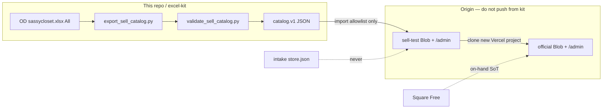

# 04 — Next.js + Vercel Blob headless clothing catalog architecture

LEARN TRACK apply playbook. Re-verified **2026-09-10** against `main` @ `ba33024`, live intake + sell-test headers, and the open kit contract on [PR #18](https://github.com/SkyLanter/Sassy-closet/pull/18).

This note is the architecture for a **headless clothing catalog**: versioned `catalog.v1` JSON, admin mutation surfaces, ISR / Blob cache pitfalls, **sell-test vs official** multi-site, and the export → import handoff.

This continuation also **applies** the one intake-side Blob cache law the 2026-09-09 draft named but did not change: illegal `cacheControlMaxAge: 0`, photo `put()` defaulting to a 1-month CDN, and `useCache: true` on overwriteable photos.

**Never invent mã.** The only sell-site codes this lane may name are the Boss allowlist of ten. Admin “Next mã A03” is a suggestion, not an assignment.

---

## 0. How to use this note

| If you need… | Jump to |
| --- | --- |
| What is true for which system | [§2 Truth layers](#2-truth-layers-do-not-collapse-them) |
| The versioned JSON contract | [§4 `catalog.v1`](#4-catalogv1--versioned-schema) |
| Intake vs shop admin APIs | [§6 Admin API](#6-admin-api-surfaces) |
| Why a saved price still looks old | [§7 ISR / cache pitfalls](#7-isr--cache-pitfalls) |
| Standing up official without killing intake | [§8 Test vs official](#8-multi-site-test-vs-official) |
| xlsx → JSON → Blob import | [§9 Export / import handoff](#9-export--import-handoff) |
| A tick list before calling it official | [§11 Apply checklist](#11-apply-checklist) |
| Live probe | [§13 Probe](#13-read-only-live-probe) |

**Contract alignment.** `excel-kit/docs/SELL_CATALOG_CONTRACT.md` is **not on `main`**. It lives on PR #18 (`cursor/catalog-export-clone-official-5ad2`). If that path is missing locally, open the PR — do **not** invent a second schema. If PR #18 merges a different allowlist or field list, update §4 from **that file**.

Granola was not signed in for this run. Public Slack `#shop-decisions` had no `catalog.v1` hits. Shop law below is from repo contracts + live HTML, not a recalled meeting.

**Sister docs (do not duplicate clocks):**

| Doc | Job |
| --- | --- |
| [PR #18](https://github.com/SkyLanter/Sassy-closet/pull/18) `SELL_CATALOG_CONTRACT.md` + `CLONE_TO_OFFICIAL.md` | Writer + official stand-up |
| [PR #24](https://github.com/SkyLanter/Sassy-closet/pull/24) | 2026-09-09 first draft of this note |
| [PR #28](https://github.com/SkyLanter/Sassy-closet/pull/28) `11-vercel-blob-admin-qa.md` | QA pack + Origin F1–F16 |
| [PR #32](https://github.com/SkyLanter/Sassy-closet/pull/32) `14-complete-admin-feature-matrix.md` | Admin HAVE vs APPLY |
| [PR #29](https://github.com/SkyLanter/Sassy-closet/pull/29) `05-nextjs-blob-catalog.md` | Short pattern card (this file is the deep one) |

---

## 1. What “headless catalog” means here

Not Shopify. Not a cart. Not a second warehouse.

```text
 Square Free          on-hand count (Track ON). Boss Save only.
 Official Excel       working copy / mã index / captions. Not inventory.
 sassycloset.xlsx     OD hub mirror of *known* rows (All sheet).
 catalog.v1 JSON      versioned, allowlist-only, customer-safe export.
 Sell Next.js + Blob  renderer + durable product bytes. Messenger CTA.
 Intake Next.js+Blob  GF Lưu / Tìm mã / Ask. Different JSON. Do not mix.
```

“Headless” here: **the sell UI does not own the row source**. Rows are assigned on the hub (Boss / Stock), exported as `catalog.v1`, then imported onto a shop Blob. The Next.js app is a **renderer + admin editor + photo proxy**, not the mã mint, not Square, and not Facebook.

Customer checkout is **Message on Messenger**. The word **Zelle** is allowed. No personal name, no cart, no card form.



---

## 2. Truth layers (do not collapse them)

| Layer | Path / URL | Wins at | Loses at |
| --- | --- | --- | --- |
| Square Free | Square Item library | On-hand qty, Track ON, SKU after Boss Save | Wishlist, candidates, captions |
| SoT Excel | `Documents/Sassy Closet/Sassy_Closet_SoT.xlsx` | Desktop working copy, next-mã **AO001-style** (`Dashboard!B21:B27`) | Live on-hand |
| OD hub | `Documents/Sassy Closet/sassycloset.xlsx` + `Photos/{MA}/` | Website-mirror rows on **All**, photo files, staff `source_link` | Customer JSON (must strip cost / source / names) |
| Intake Blob | Vercel `sassy-closet` → `sassy-closet/store.json` + `sassy-closet/photos/` | GF staged submissions, Tìm mã, CSV export | Sell tiles, Square counts |
| Sell Blob | Origin `sassy-closet-shop` (test) or a **new** official project | Customer tiles, `/m/{MA}`, `/admin` copy | Square Save, mã mint |
| `catalog.v1` | `out/sell-catalog.v1.json` (PR #18) | Handoff shape + allowlist + Boss USD table | Invented titles, hex, extra mãs |

**Wishlist ≠ stock.** `status=bought` on Wishlist is still off Square until `#shop-decisions` yes and Boss taps Save.

`excel-kit/schema.py` `parse_ma` stays AO001-style on purpose: *“Do not migrate parse_ma to A01 here — that is a separate handoff.”*

### 2.1 2026-09-10 cross-wire warning

Live intake `GET /api/submissions` is **durable** and currently holds the **same ten sell mãs**, including **P05 `sell_usd=23`**. That number is **staff / hub cell**, not a shop price.

| Surface | P05 | Rule |
| --- | --- | --- |
| Intake CSV / Tìm mã | `sell_usd=23`, `status=staged` | Legal on intake |
| Hub All `sell_usd` | may show `23` | Legal on hub |
| `catalog.v1` | `status=hold`, `priceUsd=null` | Hard-fail if `$23` ships |
| Sell-test `/m/P05` | “Status: Hold · Inbox for price” | Must **not** show `$23` |

**Do not** `kit.sh save` / import intake CSV / copy intake Blob onto official tiles. Same ten codes on two Blobs is a coincidence of the sell-test seed, not a merge key.

---

## 3. Three Vercel surfaces (never steal DNS)

| Surface | URL | Repo / root | Job | This kit lane |
| --- | --- | --- | --- | --- |
| **Intake** | https://sassy-closet.vercel.app | This repo · Root `sassy-closet/` | GF **Món mới / Sửa / Tìm mã / Ask** | Blob cache APPLY only. No Production Lưu from agents |
| **Sell-test** | https://sassy-closet-shop.vercel.app | Origin `sassy-closet-shop` | Public tiles + `/m/{MA}` + `/admin` | Read / export JSON only |
| **Official** | *new* `*.vercel.app` | **Same sell-site git**, **new** project + **new** Blob | Customer shop | Clone runbook only |

If someone “clones official” by attaching a domain to **intake**, stop.

### 3.1 Live fetch 2026-09-10 (read-only)

**Intake**

| URL | Status | Cache |
| --- | --- | --- |
| `/` | 200 | `private, no-store` · `x-vercel-cache: MISS` |
| `/admin` | 200 | same |
| `/api/submissions` | 200 | `storage.durable=true`, **10** rows |
| `/api/ma/A01` | 200 | staged + colors `Kem, Xanh` · `sell_usd=25` |
| `/api/ma/P05` | 200 | staged · `sell_usd=23` (staff) |
| `/api/ma/A03` | 404 | do not create |
| `/api/ma/AO001` | 404 | SoT mã is not an intake code |
| `/api/photos/A01/001.jpg` | 200 | function; today `public, max-age=0` until this PR ships `private, no-store` |
| `/api/export` | 200 CSV | includes `cost_*` + `source_link` — **illegal** as `catalog.v1` |

**Sell-test**

| URL | Status | Cache / note |
| --- | --- | --- |
| `/` | 200 | `x-nextjs-prerender: 1` · `x-nextjs-stale-time: 300` · `x-vercel-cache: STALE` · 10 tiles |
| `/c/ao` | 200 | same ISR shape |
| `/m/A01` | 200 | Available · `$25` |
| `/m/P05` | 200 | **Hold · Inbox for price** · no visible `$23` |
| `/m/A03` | **404** | `x-matched-path: /m/[ma]` · `x-vercel-cache: STALE` then **HIT** (cached 404 pitfall) |
| `/admin` | 200 | `private, no-store` · `MISS` · “Storage: Vercel Blob” · **Next mã A03** · **no Import** |
| `/api/catalog` | 404 | `x-vercel-cache: HIT` |
| `/api/admin/catalog` | 404 | HIT |
| `/products/A01/cover.jpg` | 200 | public JPEG · CDN **HIT** · `age` ~21k s |

Home visible USD (available only): A01 $25 · S01 $28 · P01 $5 · P03 $18 · P04 $13 · K01 $37 · H01 $8 · A02 $22. P02 / P05 Hold. **A03 is not a tile.**

Messenger Page (admin / footer): `https://www.facebook.com/profile.php?id=61594312648057`. Word **Zelle** is on the shop. No personal name.

---

## 4. `catalog.v1` — versioned schema

`schema` **must** be the string `catalog.v1`. Validators hard-fail on anything else. Cite PR #18 — do not keep a shadow schema here.

### 4.1 Envelope

```json
{
  "schema": "catalog.v1",
  "source": "Documents/Sassy Closet/sassycloset.xlsx",
  "exportedAt": "2026-09-09T01:42:55Z",
  "allowlist": ["A01", "S01", "P01", "P02", "P03", "P04", "P05", "K01", "H01", "A02"],
  "products": []
}
```

| Field | Rule |
| --- | --- |
| `schema` | Exactly `catalog.v1` |
| `source` | OD hub path (string). Not a Blob URL |
| `exportedAt` | ISO-8601 UTC |
| `allowlist` | Frozen first-ten **order**. Products must be that same order |
| `products` | Length **10**, one object per slot |

Committed artifact on PR #18: `out/sell-catalog.v1.json`. Kit-local twin: `excel-kit/samples/sell-catalog.v1.json` (must match).

### 4.2 Product object

Allowed keys only (`PRODUCT_KEYS` in `excel-kit/sell_catalog.py` on PR #18): `ma`, `titleEn`, `titleVn`, `descriptionEn`, `descriptionVn`, `type`, `status`, `priceUsd`, `qty`, `colors`, `images`. Extra keys (`cost`, `source_link`, names) **fail**.

| Field | Type | Rule |
| --- | --- | --- |
| `ma` | string | Allowlisted A01-style. Never minted |
| `titleEn` / `titleVn` | string | From xlsx if columns exist. **Live hub has no title columns — leave `""`.** Do not invent shop copy |
| `descriptionEn` / `descriptionVn` | string | Same. Do **not** copy staff `flag` notes |
| `type` | string | From mã letter via `KIND_TO_TYPE`, except `P02` / `P05` → `thermos` |
| `status` | `hold` \| `available` | Hold ⇔ `priceUsd` is JSON `null` |
| `priceUsd` | number \| `null` | Must match Boss table. Hold = `null` even if xlsx / intake has a number |
| `qty` | `1` | Unique piece. Any other value fails |
| `colors` | `{id, name?, hex?}[]` | `id` = slug of the xlsx color word. **No invented hex** |
| `images` | `{src\|url, colorId, order?}[]` | Real files only. Skip `_placeholder`, `_probe`, `.keep`, `README` |

Type map (letter → customer type). Do not invent a thirteenth type.

| Letter | `type` | EN | VN |
| --- | --- | --- | --- |
| A | `top` | Top | Áo |
| Q | `pants` | Pants | Quần |
| V | `skirt` | Skirt | Váy |
| D | `dress` | Dress | Đầm |
| K | `jacket` | Jacket | Áo khoác |
| G | `shoes` | Shoes | Giày |
| B | `bag` | Bag | Túi |
| P | `accessory` | Accessory | Phụ kiện |
| — | `thermos` | Thermos | Bình giữ nhiệt |
| H | `hair` | Hair | Tóc |
| J | `jewelry` | Jewelry | Trang sức |
| S | `set` | Set | Set đồ |
| O | `other` | Other | Khác |

`thermos` is **not** a letter. Only `P02` and `P05` (`THERMOS_MAS`). Kind letter on those rows is still `P`.

Live RSC sometimes prints letter types (`"S"`). `catalog.v1` uses words (`set`). Map only via `KIND_TO_TYPE`. Do not invent a third mapping.

### 4.3 Dual mã

| Dialect | Regex / owner | Example |
| --- | --- | --- |
| Sell + live hub | `SELL_MA_RE` — one letter + 2–3 digits. Letters `A Q V K G B P H J S O D` | `A01` |
| SoT / Square SKU | `excel-kit/schema.py` `parse_ma` | `AO001` |
| Intake mint | `sassy-closet/lib/mint.ts` `nextMa()` | `A01`, `D01` **intake-local only** |

**Do not migrate `parse_ma` to A01.** Intake mint is **not** permission to emit a new sell-site row. Export **hard-fails** on any All-sheet mã outside the allowlist.

### 4.4 Allowlist (first ten only) — cite, do not extend

| Mã | Type | USD | Status |
| --- | --- | --- | --- |
| A01 | top | 25 | available |
| S01 | set | 28 | available |
| P01 | accessory | 5 | available |
| P02 | thermos | — | **hold** (`priceUsd` null) |
| P03 | accessory | 18 | available |
| P04 | accessory | 13 | available |
| P05 | thermos | — | **hold** (`priceUsd` null) |
| K01 | jacket | 37 | available |
| H01 | hair | 8 | available |
| A02 | top | 22 | available |

`P02` / `P05` stay Hold **even when** xlsx or intake `sell_usd` is `23`. Empty `sell_usd` → Hold.

Admin “Next mã A03” (and Q01 / V01 / K02 / …) is still on live `/admin` (2026-09-10). Ignore until Boss assigns a new code **and** the allowlist is revised in kit. An 11th mã is a **code change**, not a click.

### 4.5 What the committed JSON actually contains

PR #18 `out/sell-catalog.v1.json` (do not treat titles as shop copy — they are empty):

- Titles / descriptions: `""`.
- Colors text-only (A01 `Kem` / `Xanh`; A02 `Chấm bi`). K01 / H01 may be `colors: []`.
- Images are **OneDrive relative paths**, e.g. `Documents/Sassy Closet/Photos/A01/001.jpg`. K01 / H01 / A02 use `.jpeg`. **Not** public URLs. **Not** Blob URLs.

Origin `/admin` may already have customer sentences (“One unique top on hand…”). That copy lives on the **shop Blob**. Re-import must **merge**: kit JSON wins prices / hold / images / types; keep Origin titles if JSON titles are `""`.

### 4.6 xlsx `All` column map

Read **`All` only**. Kind tabs are duplicates — merging them double-counts.

| xlsx | `catalog.v1` | Notes |
| --- | --- | --- |
| `ma` | `product.ma` | Required. Allowlist only |
| `kind` | drives `type` | Must match mã letter |
| `colors` | `colors[].name` | Split on `,` `;` `/` `\|` |
| `sell_usd` | `priceUsd` + `status` | Empty → Hold; must match Boss table when set |
| `photo_folder` | image `src` prefix | Default `Documents/Sassy Closet/Photos/{MA}/` |
| `title_*` / `description_*` | titles / descriptions | Optional; absent on live hub |
| `source_link` | **omit** | Taobao stays on the hub |
| `cost` / `currency` | **omit** | Never publish vốn |
| `square` / `status` | **omit** | Hub `staged` ≠ sell `hold\|available` |
| `flag` / `next_desk` | **omit** | Staff only |

PR #8 (hub / `kit.sh save` from intake `GET /api/export`) was still **open** as of this write. Do not assume `kit.sh` exists on `main`.

---

## 5. Two JSON brains (do not cross-wire)

### 5.1 Intake `StoreFile`

Pathnames: `sassy-closet/store.json` and `sassy-closet/photos/{rel}`.

```ts
type StoreFile = {
  nextId: number;
  submissions: Submission[];  // status: "staged"; square: "not_square"
  fx: { usd_cny: number; updated: string };
  on_hand?: Record<string, unknown>;  // never fake if missing
};
```

`Submission` carries cost, Taobao `link`, photo hashes, caption drafts, `photo_link` folder path. `GET /api/export` includes `cost_*` and `source_link` — fine for kit backup, **illegal** as `catalog.v1`.

`on_hand` empty → Tìm mã says **Staged only — not on Square On_Hand yet**. Never invent qty / $ / storage.

`parseStore` refuses garbage (`Kho mã đọc lỗi — không ghi đè`). A corrupt Blob must **not** become an empty closet.

### 5.2 Sell `catalog.v1`

Customer-safe, allowlist, `qty=1`, no cost, no source, no PII.

**Do not** point the shop reader at intake `store.json`. **Do not** import intake CSV into official tiles. **Do not** copy intake Blob prefixes onto the shop store.

---

## 6. Admin API surfaces

Two admins. Different auth, different JSON, different “Save”.

### 6.1 Intake (this repo) — implemented

| Method | Path | Job |
| --- | --- | --- |
| GET | `/api/submissions` | `{ submissions, storage }` — `storage.durable` is Blob health |
| POST | `/api/submissions` | multipart Lưu (create). May mint next letter-code **inside intake only** |
| GET | `/api/submissions/{ma}` | `{ ma, caption_vi, submission }` |
| PATCH | `/api/submissions/{ma}` | multipart Sửa / rename |
| GET | `/api/ma/{code}` | Read-only `{ staged, on_hand, staged_only }` |
| POST | `/api/find-ma` | Photo-hash match |
| GET | `/api/photos/{ma}/{file}` | Bytes from Blob or disk. UI stays on this URL |
| GET | `/api/export` | CSV `sassy-closet.csv` |
| GET | `/admin` | “Tải CSV” + Kho durable/ephemeral. `dynamic = "force-dynamic"` |

Ask relay (`/api/ask*`) is **not** a catalog API. Do not copy those envs onto the shop.

### 6.2 Sell-test / official — Origin-owned

Live `/admin` (2026-09-10): Server-rendered editor, **Storage: Vercel Blob**, Catalog (10), Save {MA}, Hold / Available, Upload image, **Next mã A03**. **No** `catalog.v1` Import / Export button. Public `GET /api/catalog` and `GET /api/admin/catalog` still **404 HIT**.

Recommended Origin REST (proposal — implement on Origin, not in this kit repo):

| Method | Path | Job |
| --- | --- | --- |
| GET | `/api/admin/catalog` | Allowlist JSON the QA gate can see |
| POST | `/api/admin/catalog/import` | `catalog.v1` merge (empty titles do not wipe Origin copy) |
| POST | `/api/admin/revalidate` | Path + tag bust after Save / import |
| GET | `/api/admin/health` | `{ storage: "blob", count: 10 }` |

Until Import lands: kit JSON + human photo upload + Mini Boss merge. Do **not** invent an auth token in this repo. Do **not** add a password wall on `/admin` (playbook: keep Back to shop).

Server `put` body cap is **4.5 MB**. Phone garment photos often exceed that — Origin should use **client upload** for images, server `put` for JSON.

---

## 7. ISR / cache pitfalls

This is the section that burns shops: **you saved Hold on P05 and the tile still says $23**, or **you imported ten mãs and `/` still shows nine**, or **a redeploy “emptied” the catalog** because it was never on Blob.

### 7.1 Four Next.js caches (plus Vercel CDN + Blob CDN)

| Layer | What | Cross-request? | Bust with |
| --- | --- | --- | --- |
| Request memoization | Same `fetch` in one render | No | n/a |
| Data Cache | `fetch` / `unstable_cache` | Yes | `revalidateTag` / `revalidatePath` / `cache: 'no-store'` |
| Full Route Cache | HTML + RSC for static routes | Yes | `revalidatePath`, time `revalidate`, dynamic opt-out |
| Router Cache | Client RSC on navigation | Tab session | `router.refresh()`, Server Action revalidate |
| Vercel CDN | `x-vercel-cache: HIT\|STALE\|MISS` | Yes | Cache-Control + path revalidate |
| Blob CDN | `get()` of a pathname | Yes; default ~1 month; overwrite up to **60s** stale | `useCache: false` on private `get()`; new pathname; wait |

Intake pages that read the store already opt out of Full Route Cache:

```3:3:sassy-closet/app/page.tsx
export const dynamic = "force-dynamic";
```

```3:3:sassy-closet/app/admin/page.tsx
export const dynamic = "force-dynamic";
```

Sell-test public pages are the opposite. 2026-09-10: `x-nextjs-prerender: 1`, **`x-nextjs-stale-time: 300`**, `cache-control: public, max-age=0, must-revalidate`, `x-vercel-cache: STALE` on `/`, `/c/ao`, `/m/A01`, `/m/P05`, and even **`/m/A03` 404**.

`STALE` = served old HTML while a background regenerate runs. `max-age=0, must-revalidate` only forces the **browser / CDN to revalidate**. If the Full Route Cache still has a stale RSC payload, that revalidate can HIT the old page. Next ISR guide: after the window, “the next request will still return the cached (now stale) page.”

`stale-time: 300` is a **five-minute** stale window on sell-test. A Hold flip that only relies on this clock can lie for five minutes. Commerce events need **on-demand** `revalidatePath` + a warm GET, not `revalidate: 3600` alone.

### 7.2 Next.js 15 `fetch` default vs Data Cache

Next.js 15 `fetch` is **uncached by default**. Opt in with `cache: 'force-cache'` or `next: { revalidate }`.

Pitfall: wrap `get('catalog.json')` in `fetch(blobUrl, { next: { revalidate: 3600 } })` **and** also use the Blob SDK `get()`. Two caches, two clocks. Prefer: SDK `get(..., { useCache: false })` for the mutable catalog document; let the **route** decide ISR via `revalidatePath` after admin writes.

If **any** fetch on a route is `revalidate: 0` / `no-store`, the **whole route** becomes dynamic. Mixing “static PDP” + “no-store catalog read” silently disables ISR.

### 7.3 Blob overwrite is not read-after-write safe

Vercel Blob (SDK + caching docs):

- Default CDN cache: **up to 1 month**.
- Overwrite of an existing pathname: readers may see previous bytes for **up to 60 seconds**.
- `cacheControlMaxAge` **cannot be set below 60**. `0` is illegal.
- Private `get({ useCache: false })` skips the CDN (consistent; costs origin transfer).
- New pathname → immediately consistent.
- Private vs public store is **immutable** after create. Intake: Access **Private**; `BLOB_ACCESS` must match. Public bytes need a public store or a proxy.

### 7.4 Intake APPLY (this PR)

The 2026-09-09 draft cited this exact pattern and left it in place:

```ts
put(STORE_BLOB_PATH, json, { cacheControlMaxAge: 0, allowOverwrite: true, addRandomSuffix: false });
get(photoPath, { useCache: true });
put(photoPath, bytes, { allowOverwrite: true }); // no cacheControlMaxAge → default 1 month
```

This continuation applies:

| Call | Before | After |
| --- | --- | --- |
| Store / photo `put` | `cacheControlMaxAge: 0` or omitted | `blobWriteOptions` → **60s**, `allowOverwrite: true`, `addRandomSuffix: false` |
| Store / photo `get` | photos `useCache: true` | `blobConsistentReadOptions` → **`useCache: false`** |
| `/api/photos` response | no Cache-Control (Vercel `public, max-age=0`) | `Cache-Control: private, no-store` |

Helpers: `BLOB_SDK_MIN_CACHE_CONTROL_MAX_AGE`, `blobWriteOptions`, `blobConsistentReadOptions` in `sassy-closet/lib/store-backend.ts`.

Shop official should copy the **split**: catalog JSON = consistent read; **immutable** photo pathnames may be cached. Intake photos are **overwriteable** (same `001.jpg` after Sửa), so they stay consistent-read + no-store.

Stable pathnames (`addRandomSuffix: false`) are still required. A random suffix on `store.json` makes the next deploy look like an empty closet.

### 7.5 `revalidatePath` does not regenerate now

It **marks** the path. Regeneration happens on the **next visit**. Route Handlers do not refresh an open tab’s Router Cache. Server Actions can; a cron `POST /api/revalidate` will not.

After import / Save {MA}:

1. Write Blob JSON (`useCache: false` on the next read).
2. `revalidatePath('/')`, `revalidatePath('/c/[slug]', 'page')`, `revalidatePath('/m/[ma]', 'page')` (real shop patterns).
3. If the mutator is a Route Handler, hard-refresh or `router.refresh()`.
4. Warm `/`, `/m/{MA}`, `/c/ao` and confirm `x-vercel-cache` is not a 10-minute-old STALE with the previous price.

### 7.6 Failed regenerate keeps the last good page

If regeneration throws, **the last successful HTML stays**. A broken import can leave **Available $23** on P05 while `/admin` shows Hold. Validate **before** write; after write, fetch public HTML and assert Hold copy.

### 7.7 `generateStaticParams` must not invent mã

Static params = **intersection of Blob products ∩ allowlist**. Unknown `/m/A99` → 404. Do not prerender `A03` because admin showed “next unused”. Do not prerender intake-only codes.

### 7.8 Cached 404s

`/m/A03` is already a cached 404 (`STALE` then `HIT` on a later fetch). `/api/catalog` is a **HIT 404**. After adding those routes: redeploy or `revalidatePath` the **exact** path. Rewrites are not applied on on-demand ISR.

### 7.9 Photo proxy vs public `/products/{MA}/cover.jpg`

Intake: UI stays `/api/photos/{ma}/{file}` and streams private Blob.

Sell-test: `/products/A01/cover.jpg` is a **public CDN HIT** (2026-09-10, `age` ~21k s). Official must pick:

- **A.** Public Blob / `public/products/{MA}/` + hashed filenames on replace.
- **B.** Private Blob + function proxy + short/private Cache-Control.

Do not leave `src` as `Documents/Sassy Closet/Photos/A01/001.jpg` on customer HTML. `blob:` object URLs in JSON fail validation. Never persist a browser object URL.

### 7.10 Ephemeral disk is a shredder

Vercel `/tmp` dies on Production redeploy. Intake already lost mãs this way. Official **must** show `/admin` → Storage: Vercel Blob **before** go-live. Blob cannot resurrect `/tmp` ghosts.

Hobby caps: 1 GB, 10k simple reads / 2k writes / month. `force-dynamic` `/` that `get()`s JSON on every bot hit burns reads. Boutique volume fits; do not poll.

`blobConfigured()` = `BLOB_READ_WRITE_TOKEN` **or** `BLOB_STORE_ID` (OIDC). Official should use the same idea so a missing token does not silently fall through to `/tmp`.

### 7.11 Multi-instance ISR

Default filesystem cache is **per instance**. Vercel Production coordinates `revalidatePath`. Self-hosted / multi-region needs a shared `cacheHandler`.

### 7.12 Practical matrix

| Surface | Recommended render | Catalog / photo read | After Save |
| --- | --- | --- | --- |
| Intake `/` `/admin` `/api/*` | `force-dynamic` (already) | Blob `useCache: false` | n/a |
| Shop `/admin` | `force-dynamic` | Blob `useCache: false` | `revalidatePath` public routes |
| Shop `/` `/c/[slug]` `/m/[ma]` | ISR **or** dynamic | Same JSON; tag `catalog` | Revalidate **and** warm |
| Shop photos | static or long CDN | **immutable** pathnames | New filename on replace |
| Hold / price | Must not wait 300s / 3600s | Never time-ISR alone | On-demand + verify HTML |

---

## 8. Multi-site: test vs official

### 8.1 Why two shops

Sell-test is the sandbox that already shows the ten mãs. Official is a **new Vercel project** so a bad import, a leaked Ask secret, or a domain typo cannot take down GF intake or the experiment. Soft-launch stays on sell-test until the clone checklist is green and `#shop-decisions` says yes.

### 8.2 What to copy

| Copy | How |
| --- | --- |
| Next.js sell-site git | Import Origin `sassy-closet-shop`, **not** this kit repo, **not** Root Directory `sassy-closet` |
| `catalog.v1` rows | JSON import or Blob-to-Blob of **allowlist only** |
| Real photos | OD `Photos/{MA}/` — real files only |
| Messenger CTA + Page URL | Confirm with Boss; same Page is fine |
| Word **Zelle** | Keep |
| Hold on P02 / P05 | Keep; no $23 |
| Kelly Ying tokens | Stay on the **shop**. Do not restyle intake rose / Allura onto official |

### 8.3 What never to copy

| Do not copy | Why |
| --- | --- |
| Intake project / domain | Wrong surface |
| Intake Blob / `store.json` | Staged GF + cost + source; P05 `$23` |
| Sell-test Blob as a permanent pointer | One-time migrate, then disconnect |
| `MINIBOSS_ASK_WEBHOOK_*` / `ASK_REPLY_SECRET` | Unless Boss wants Ask on the shop |
| Square Save / FB Post-Send bots | Shop law |
| Personal name / phone | Contract |
| Admin “next A03” as a live row | Invented mã |
| `_placeholder` / `_probe` / `.keep` | Not a real photo |
| SoT `AO001` as shop SKU | Shop is A01-style allowlist |

### 8.4 Three Blobs, three identities

```text
intake Blob     sassy-closet/store.json + photos/     GF
sell-test Blob  Origin catalog + /products covers     experiment
official Blob   own catalog + photos                  customers
```

### 8.5 Verify isolation

1. Intake still https://sassy-closet.vercel.app (rose / Allura / four tabs).
2. Sell-test still https://sassy-closet-shop.vercel.app until Boss sunsets it.
3. Official is a **third** hostname.
4. Three Blob store IDs. Intake migrate copies local → Blob **only if Blob is empty** — a shop seed written into the intake store is seed drift.

---

## 9. Export / import handoff

Kit **does not push Origin**.

### 9.1 Export (PR #18)

```bash
python3 excel-kit/scripts/export_sell_catalog.py \
  -w "$HOME/OneDrive/Documents/Sassy Closet/sassycloset.xlsx" \
  --photos-dir "$HOME/OneDrive/Documents/Sassy Closet/Photos" \
  -o ./out/sell-catalog.v1.json
```

- Missing xlsx → exit **2**, no fake rows.
- `-w` set but file missing → exit **2** (do not fall back to another book).
- `--photos-dir` omitted → `images: []` (valid).
- Read **All** only.

### 9.2 Validate

```bash
python3 excel-kit/scripts/validate_sell_catalog.py ./out/sell-catalog.v1.json
```

Playbook PR #29 adds a second gate (`excel-kit/sot/validate_sell_catalog_export.py`) that also accepts `products[]`. Prefer **one** allowlist constant long-term. Do not grow a third tuple.

### 9.3 Import (Origin)

Until the Import button lands: human `/admin` Save + Upload image, or Mini Boss Origin agent. Merge rules: §4.5. Then revalidate + warm.

### 9.4 Photo inventory (real OD files — skip junk)

| Mã | Real files |
| --- | --- |
| A01 | `001.jpg`, `002.jpg` |
| S01 | `001.jpg` |
| P01 | `001.jpg`, `002.jpg` |
| P02 | `001.jpg`, `002.jpg` |
| P03 | `001.jpg`, `002.jpg`, `003.jpg` |
| P04 | `001.jpg`, `002.jpg` |
| P05 | `001.jpg`, `002.jpg`, `003.jpg` |
| K01 | `001.jpeg`, `002.jpeg` |
| H01 | `001.jpeg`, `002.jpeg`, `003.jpeg` |
| A02 | `001.jpeg`, `002.jpeg` |

Never invent a missing `002`. Intake Production photo counts (2026-09-10) match this table.

### 9.5 Reverse handoff (shop → hub)

Shop titles may later flow back to hub columns **if those columns exist**. Do not invent the columns. Do not write customer names into git.

### 9.6 When Boss adds an 11th mã

1. Boss assigns the code (Stock / `#shop-decisions`).
2. Hub All gets a real row + real photos.
3. Kit allowlist **code change** (PR #18 contract).
4. Then export / import. Extras hard-fail until step 3.

---

## 10. Hard stops (every lane)

- Never invent mã / stock / prices / hex / titles / photos.
- Never Square Save or Facebook Post / Send from a site or agent.
- Never commit secret **values**.
- Never reuse a Sold mã.
- Never publish P05 / P02 `$23`.
- Never steal intake DNS.
- Never cross-wire `store.json` ↔ `catalog.v1`.
- Bots draft only. Owner posts, messages, takes Zelle, taps Square Save.

---

## 11. Apply checklist

### Kit / JSON

- [ ] PR #18 contract readable on `main`, or §4 still matches it
- [ ] `validate_sell_catalog.py` PASS
- [ ] Allowlist / order = `A01 S01 P01 P02 P03 P04 P05 K01 H01 A02`
- [ ] P02 / P05 `status=hold`, `priceUsd` null
- [ ] Prices: A01 $25 · S01 $28 · P01 $5 · P03 $18 · P04 $13 · K01 $37 · H01 $8 · A02 $22
- [ ] No `cost`, `source_link`, names, `blob:` image URLs
- [ ] Titles empty unless hub actually has those columns

### Official project

- [ ] New Vercel project (not intake, not a domain steal)
- [ ] Root Directory = **sell-site**, not `sassy-closet/`
- [ ] Official Blob on Production; `/admin` says Vercel Blob
- [ ] Ask / GF env vars omitted
- [ ] Exactly 10 mãs imported or Blob-migrated
- [ ] Real OD photos; no placeholders
- [ ] Customer colors as text
- [ ] Messenger CTA = real Page; Zelle word; **no personal name**
- [ ] After Save/import: revalidate + warm `/`, `/c/ao`, `/m/A01`, `/m/P05`
- [ ] Public P05 is Hold / Inbox for price — **not $23**
- [ ] `/m/A03` is 404
- [ ] Intake still https://sassy-closet.vercel.app
- [ ] Sell-test left up until Boss sunsets
- [ ] `#shop-decisions` yes

### Cache smoke

- [ ] On sell-test only (not Production): Save then hard-refresh `/m/{MA}`
- [ ] `curl -I` and understand HIT vs STALE vs MISS (`stale-time: 300` is not a Hold bust)
- [ ] Redeploy official once; 10 mãs + photos still on Blob, not `/tmp`

### Intake Blob (this PR)

- [x] `cacheControlMaxAge` ≥ 60 on store + photo `put`
- [x] `useCache: false` on store + photo `get`
- [x] `/api/photos` `private, no-store`
- [x] Unit test for the option helpers
- [ ] After Production deploy: `curl -I /api/photos/A01/001.jpg` shows `private, no-store`

### Origin (cite PR #28 F-list — do not implement here)

F1 consistent catalog read · F2 overwrite write · F3 Save receipt · F4 `revalidatePath` signatures · F5 two public warms · F6 failed regenerate must not keep last-good lies · F7 photos never silent overwrite · F8 kill Next-grid publish · F9 `GET /api/admin/catalog` · F10 `/admin` uncached · F11 Hold ⇔ price server-side · F12 look lock · F13 two Blob stores · F14 admin marker · F15 `POST /api/admin/revalidate` · F16 Import `catalog.v1`.

---

## 12. Related LEARN TRACK / kit docs

| Path / PR | Job |
| --- | --- |
| This file | Deep architecture |
| PR #18 | Writer + `CLONE_TO_OFFICIAL.md` |
| PR #28 | QA + Origin F-list |
| PR #32 | Admin feature matrix |
| PR #29 `05-nextjs-blob-catalog.md` | Short Blob pattern card |
| PR #29 `06-clone-to-official.md` | Playbook clone notes (do not replace PR #18) |
| `sassy-closet/README.md` | Durable store Boss clicks |
| `excel-kit/schema.py` | AO001 `parse_ma` — do not migrate |

---

## 13. Read-only live probe

```bash
python3 docs/ai-clothing-shop/qa/probe_catalog_arch.py
```

Read-only. Hits intake + sell-test. Asserts host isolation, the ten tiles, Hold on P05 (no visible `$23`), `/m/A03` 404, ISR vs `force-dynamic` headers, durable intake, and “no public catalog API yet”. Exit `2` on network failure (does **not** invent a passing catalog). Exit `1` on a law break.

Not wired into default CI (needs live hosts).

---

## 14. What this continuation changed in-repo

| File | Change |
| --- | --- |
| `sassy-closet/lib/store-backend.ts` | Shared put/get options; 60s max-age; consistent photo reads |
| `sassy-closet/app/api/photos/[...path]/route.ts` | `private, no-store` |
| `sassy-closet/tests/store.test.ts` | Option-helper assertions |
| `sassy-closet/README.md` / `BOSS.md` | Blob cache + no cross-wire |

No Origin shop edits. No Square Save. No new mãs.

---

## Sources

- [S1] PR #18 `excel-kit/docs/SELL_CATALOG_CONTRACT.md` (fetched 2026-09-10)
- [S2] PR #18 `excel-kit/docs/CLONE_TO_OFFICIAL.md`
- [S3] Repo `README.md`, `excel-kit/DESIGN_NOTES.md`, `excel-kit/schema.py` (`parse_ma` comment)
- [S4] `sassy-closet/README.md`, `BOSS.md`, `lib/store-backend.ts`, `lib/mint.ts`, `app/api/*`
- [S5] Live GET/HEAD 2026-09-10: `sassy-closet.vercel.app`, `sassy-closet-shop.vercel.app` (tables in §3.1)
- [S6] [Next.js ISR](https://nextjs.org/docs/app/guides/incremental-static-regeneration) + [caching](https://nextjs.org/docs/app/guides/caching) + [`revalidatePath`](https://nextjs.org/docs/app/api-reference/functions/revalidatePath)
- [S7] [Vercel Blob SDK](https://vercel.com/docs/vercel-blob/using-blob-sdk) — `cacheControlMaxAge` min 60; [caching](https://vercel.com/docs/vercel-blob#caching); `get({ useCache: false })`
- [S8] PR #28 F-list · PR #32 admin matrix · PR #29 playbook 05
- [S9] Facebook Page id `61594312648057` (observed on sell-test, not invented)
